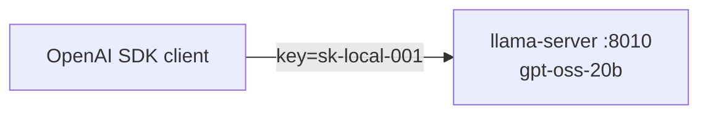
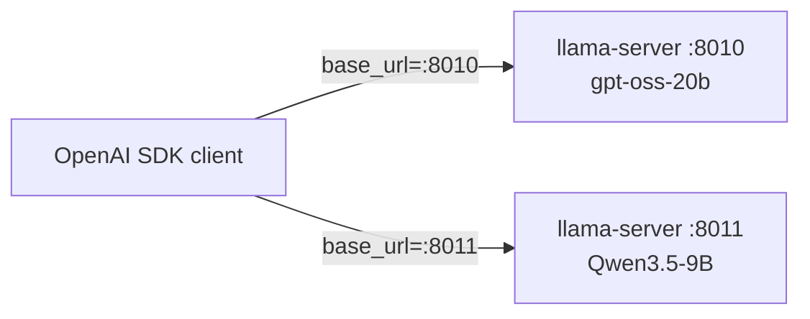
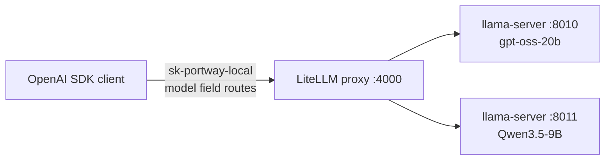
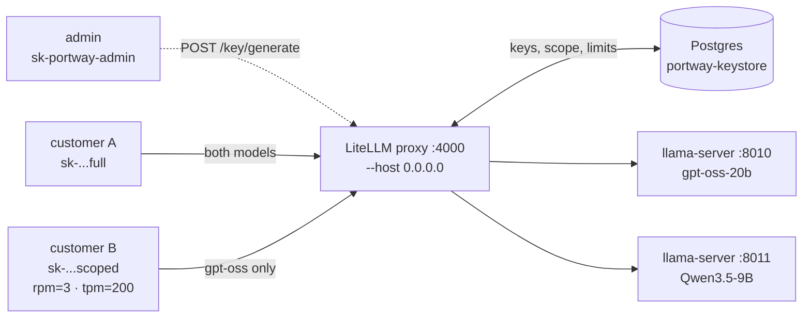

# ⚓ portway

> Self-hosted, run-anywhere gateway that routes and meters traffic across multiple local LLMs behind one OpenAI-compatible API.

## What it is

`portway` is a thin, self-hostable inference gateway. Point any OpenAI SDK at it, pass a model name, and it routes the request to the right backend — your own vLLM/llama.cpp model servers — while handling auth, per-key model scoping, rate limits, and token metering. Add a model with one config line. Move it from your laptop to a cloud region by swapping an env file. No vendor lock-in, no data leaving the boundary you choose.

- **One endpoint, many models** — clients pick the model via the standard `model` field; portway routes it.
- **OpenAI-compatible end to end** — swap or add a backend with a config change, not a rewrite.
- **Stateless by design** — clients carry conversation history; backends stay disposable and horizontally scalable.
- **Metered & key-scoped** — exact token accounting per request, per-key model permissions, token-based rate limits, billing-ready.
- **Run anywhere** — identical images on laptop, homelab, or any cloud/region; location is config, not architecture.

## Architecture

```
                       ┌──────────────────────────────────────────────┐
   agents / apps       │   DEPLOYMENT TARGET  (pluggable, chosen late) │
   (carry their        │   laptop · homelab · any cloud · any region   │
    own history) ──────┼──▶ ┌──────────┐    ┌───────── vLLM/llama.cpp ─┐│
                       │    │ portway  │───▶│  gpt-oss-20b  (served)   ││
                       │    │  gateway │    └──────────────────────────┘│
                       │    │ • auth   │    ┌───────── vLLM/llama.cpp ─┐│
                       │    │ • routing│───▶│  qwen3.5  (served)       ││
                       │    │ • meter  │    └──────────────────────────┘│
                       │    └────┬─────┘                                 │
                       │         ▼                                       │
                       │   ┌──────────────┐  ┌──────────────┐            │
                       │   │ metering DB  │  │ thread store │            │
                       │   └──────────────┘  └──────────────┘            │
                       └──────────────────────────────────────────────┘
```

<details>
<summary><strong>How it grows, post by post</strong> (click to expand)</summary>

**Post 1 — one model, one process:**


**Post 2 — second backend on a second port; client picks the URL:**


**Post 3 — gateway in front; client picks the model, not the URL:**


**Post 4 — admin/customer key split, Postgres-backed virtual keys, per-key scoping + rate limits, LAN-reachable:**


</details>

## Quickstart

```bash
# 1. serve a model locally (OpenAI-compatible)
vllm serve openai/gpt-oss-20b --served-model-name gpt-oss --api-key sk-local-001

# 2. start the gateway
portway --config config.yaml --port 4000

# 3. call it with the stock OpenAI SDK
curl http://localhost:4000/v1/chat/completions \
  -H "Authorization: Bearer <your-portway-key>" \
  -d '{"model":"gpt-oss","messages":[{"role":"user","content":"hello"}]}'
```

## Series Progress

Built step-by-step — check each post off as it ships.

- [x] [**Post 1** — Local-first: a model on your own machine, zero cloud](./docs/1%20-%20Local-first:%20a%20model%20on%20your%20own%20machine,%20zero%20cloud.md) *(no cloud · $0)*
- [x] [**Post 2** — Two models locally, and the art of placing them](./docs/2%20-%20Two%20models%20locally,%20and%20the%20art%20of%20placing%20them.md) *(no cloud · $0)*
- [x] [**Post 3** — The gateway: route by model name](./docs/3%20-%20The%20gateway:%20route%20by%20model%20name.md) *(no cloud · $0)*
- [x] [**Post 4** — Auth, API keys, and per-key model scoping](./docs/4%20-%20Auth,%20API%20keys,%20and%20per-key%20model%20scoping.md) *(no cloud · $0)*
- [ ] **Post 5** — Token tracking & metering *(no cloud · $0)*
- [ ] **Post 6** — Conversation state & context management *(no cloud · $0)*
- [ ] **Post 7** — Streaming, performance & load *(no cloud · $0)*
- [ ] **Post 8** — Containerize & make deployment location-agnostic *(no cloud · $0)*
- [ ] **Post 9** — Deploy to a cloud — any provider, any region *(optional · rental)*
- [ ] **Post 10** — Data residency & region policy *(optional · rental)*
- [ ] **Post 11** — Scaling & reliability *(optional · rental)*
- [ ] **Post 12** — Users, teams, admin UI, and registration *(optional · rental)*
- [ ] **Post 13** — Observability, billing, hardening & launch *(optional · rental)*
- [ ] **Post 14** — Extending the catalog *(optional)*

## Status

🚧 Early development — built in the open as a step-by-step series, from a single local model to a production multi-model provider.

## License

Apache-2.0
