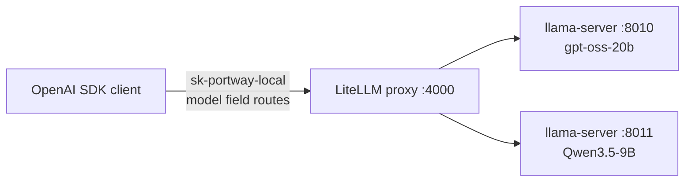

# Post 3 — The gateway: route by model name

> Goal: one local endpoint; clients pick the model via the OpenAI `model` field; the gateway routes to the right Post-2 backend. Plus: surface each model's reasoning channel as its own first-class field (`reasoning_content`) instead of inlining it in `content`.

This walkthrough is the concrete, runnable counterpart to Post 3 in [`series.md`](./series.md). Everything here runs locally for $0.

← Previous: [Post 2 — Two models locally, and the art of placing them](./2%20-%20Two%20models%20locally,%20and%20the%20art%20of%20placing%20them.md) · ⤴ Start of series: [Post 1 — Local-first: a model on your own machine, zero cloud](./1%20-%20Local-first:%20a%20model%20on%20your%20own%20machine,%20zero%20cloud.md)



## What's in this post

- `3-gateway/config.yaml` — LiteLLM proxy config: two routes (`gpt-oss`, `qwen3.5`), one master key, `drop_params` for forward-compatibility.
- `3-gateway/start-gateway.sh` — start/stop wrapper for the proxy on `:4000`.
- `3-gateway/demo.py` — three blocks:
  1. **Gateway inventory:** GET `/v1/models` on the gateway, see both routes.
  2. **Same prompt, two voices, one base URL:** flip `model` between `gpt-oss` and `qwen3.5` against the same client; reasoning lives in its own field.
  3. **Bad model name:** request `gpt-99`, get an OpenAI-shaped error instead of a bare 500.

## How this differs from Post 2

[Post 2](./2%20-%20Two%20models%20locally,%20and%20the%20art%20of%20placing%20them.md) gave every model its own port and made the client pick the URL. That works until the client list grows past two — every consumer suddenly has to know your backend topology. The gateway flips that: one base URL, the standard OpenAI `model` field is the routing key, and adding a third backend is a config edit instead of a client-side change.

**Why LiteLLM (instead of ~40 lines of FastAPI).** The series prescribes LiteLLM as the recommended option, and the reason it pays off here is what comes next: Post 4 will graft per-customer virtual keys and per-key model scoping onto this same proxy, Post 5 will wire metering callbacks into it. Building the DIY version now means rewriting it twice. LiteLLM also handles OpenAI's error-shape contract and reasoning-content normalization out of the box — both of which Post 3's DoD calls for.

## Prerequisites

- Post 2 is working: `2-two-models/start-backends.sh` runs cleanly and both `:8010/v1/models` and `:8011/v1/models` respond.
- `2-two-models/start-backends.sh` has been updated to pass `--jinja --reasoning-format auto` to both `llama-server` invocations (see "Things that bit"). Restart Post 2's backends after that change.
- [uv](https://docs.astral.sh/uv/) installed (`uv --version`).
- **Python 3.13, not 3.14.** The workspace pins `requires-python = "<3.14"` because LiteLLM 1.86's proxy entrypoint hardcodes `uvloop`, and `uvloop` doesn't import on CPython 3.14 yet. If you're on a fresh 3.14 box, `uv venv --python 3.13` before `uv sync`.

## Run it

From the repo root:

```bash
# 1. Backends from Post 2 (if not already running).
2-two-models/start-backends.sh
# Wait for "server is listening" in both 2-two-models/logs/*.log.

# 2. Sync dependencies (first time only).
uv sync

# 3. Launch the gateway.
3-gateway/start-gateway.sh
# Tail with:  tail -f 3-gateway/logs/gateway.log
# Stop with:  3-gateway/start-gateway.sh stop

# 4. Once /v1/models on :4000 responds, run the demo.
uv run --project 3-gateway python 3-gateway/demo.py
```

## Sample output

_(Captured on this machine — M4 Pro Mac, 48 GB, llama.cpp build 9430 / Metal, LiteLLM 1.86.x.)_

```text
============================================================
Block 1 — /v1/models on the gateway
============================================================
http://127.0.0.1:4000/v1/models -> ['gpt-oss', 'qwen3.5']

============================================================
Block 2 — same prompt, two voices, one base URL
============================================================
--- gpt-oss ---
content:           Ottawa is Canada’s capital because the federal government chose it in 1857 as a neutral, centrally located seat between Ontario and Quebec, and it has since housed Parliament Hill, the Prime Minister’s residence, and the nation’s executive institutions.
reasoning (≤200):  The user asks: "In one sentence, what makes Ottawa Canada's capital?" They want a one-sentence answer explaining why Ottawa is the capital of Canada. Likely mention that it's designated by the Constit…
usage:             CompletionUsage(completion_tokens=258, prompt_tokens=77, total_tokens=335, completion_tokens_details=None, prompt_tokens_details=PromptTokensDetails(audio_tokens=None, cached_tokens=60))
--- qwen3.5 ---
content:           Ottawa is Canada's capital because it was chosen in 1857 by Queen Victoria as a political compromise between the English and French-speaking regions of the country.
reasoning (≤200):  Thinking Process:

1.  **Analyze the Request:**
    *   Question: "In one sentence, what makes Ottawa Canada's capital?"
    *   Constraint: "In one sentence."
    *   Subject: Ottawa, Canada's capita…
usage:             CompletionUsage(completion_tokens=4127, prompt_tokens=21, total_tokens=4148, completion_tokens_details=None, prompt_tokens_details=PromptTokensDetails(audio_tokens=None, cached_tokens=17))

============================================================
Block 3 — unknown model name returns a clean OpenAI-shaped error
============================================================
status:  400
body:    {'message': '/chat/completions: Invalid model name passed in model=gpt-99. Call `/v1/models` to view available models for your key.', 'type': 'None', 'param': 'None', 'code': '400', 'provider_specific_fields': {'error': '/chat/completions: Invalid model name passed in model=gpt-99. Call `/v1/models` to view available models for your key.'}}
```

**Worth staring at in Block 2:**

- **`content` is the same shape Post 2 produced**, but now arrives via one base URL. Adding a third route is a config edit on the gateway, not a client change.
- **`reasoning_content` is its own field.** gpt-oss's Harmony trace and Qwen3.5's `<think>` block both land in the same slot — Post 5's metering will need to count both separately. Note that `completion_tokens` (258 / 4127) is still counting the *full* reasoning trace; only the wire-level split has moved.
- **`reasoning_effort` passes through unchanged.** Add `extra_body={"reasoning_effort": "low"}` to a gpt-oss call and the gateway forwards it — useful when you want the visible answer without the long reasoning trace. LiteLLM does this for free; no gateway code involved.

**Worth staring at in Block 3:** the body is the OpenAI error shape (`{message, type, code, ...}`) and stock OpenAI SDKs raise the right exception class automatically — nothing in client code has to know LiteLLM is involved.

## Definition of Done

- [x] `/v1/models` on `:4000` lists both `gpt-oss` and `qwen3.5` — Block 1.
- [x] Flipping `model` between the two names on the same base URL hits different local backends — Block 2.
- [x] An unknown model name returns a clean OpenAI-shaped error — Block 3.
- [x] `reasoning_content` is populated for both models in Block 2.

## Things that bit, worth noting now

- **Port `4000` is convention, not law.** LiteLLM defaults to it but anything you've touched recently is a hazard (other proxies, dashboards, the last container you forgot to stop). `lsof -i :4000` before you commit to it, same discipline as Post 2's `:8010/:8011`.
- **LiteLLM returns 400 (not 404) for unknown models, but the body shape is still OpenAI-compliant.** The plan assumed a 404 for an unknown `model`; LiteLLM 1.86.2 returns 400 with the same `{error: {message, type, code}}` body shape. The OpenAI SDK's `.body` attribute exposes the *inner* error dict (envelope stripped), so the printed body looks like `{message, type, code, ...}` rather than `{error: {message, ...}}`. The wire payload does carry the envelope — `.body` is an SDK convenience that strips it. Block 3 catches `(BadRequestError, NotFoundError)` so the demo passes whether LiteLLM returns 400 today or 404 in a future version, and prints whatever status the gateway chose.
- **`openai/` in `litellm_params.model` is the *provider prefix*, not your alias.** `model_name` is the public alias clients send; `litellm_params.model` tells LiteLLM how to talk to the backend. Both fields hold strings that look like model names — easy to wire backwards. The error when you do is confusing ("model not found" with the right name visible in logs).
- **Two layers of auth, two different keys.** `master_key` (in `general_settings`) is what clients send to the gateway. The per-route `api_key` (in `litellm_params`) is what the gateway sends to the backend. Conflating them is the most common first-day bug. Post 4 turns the client-side key into per-customer virtual keys.
- **Reasoning lives in `reasoning_content`, not `content`.** A client that logs only `content` will wonder where 3000 tokens went — same observation as Post 2, now with a place to look. Different llama-server flags control this: without `--jinja --reasoning-format auto`, the field stays `None`. That's why Post 3 includes a one-line back-edit to `2-two-models/start-backends.sh`.
- **`drop_params: true` silently swallows unknown params.** Useful default — it means newer OpenAI SDK fields don't error the proxy out — but it also means typos in request bodies vanish without a peep. Worth knowing now so a bug hunt in Post 5 doesn't take an hour.
- **Python 3.14 + LiteLLM 1.86 = no proxy.** LiteLLM's proxy entrypoint hardcodes `uvloop`, and the locked `uvloop 0.21` doesn't import on CPython 3.14 (`ImportError: cannot import name 'BaseDefaultEventLoopPolicy' from 'asyncio.events'`). Bumping `uvloop>=0.22` resolves the import, but on 3.14 it forces uv to back LiteLLM down to 1.57 — a version that predates `reasoning_content` forwarding entirely. The clean fix is the one we ship: pin the workspace to Python `<3.14` so LiteLLM stays at 1.86.x with reasoning_content support intact. The Python pin sits in the root `pyproject.toml`; readers on a fresh 3.14 venv should `uv venv --python 3.13`.
- **`/v1/models` matters for framework clients.** LangChain, Continue.dev, Cursor, and similar tools call it on startup; a wrong or empty list produces confusing downstream errors with no obvious cause. Always verify the proxy's `/v1/models` returns what you expect *before* pointing real tooling at it.
