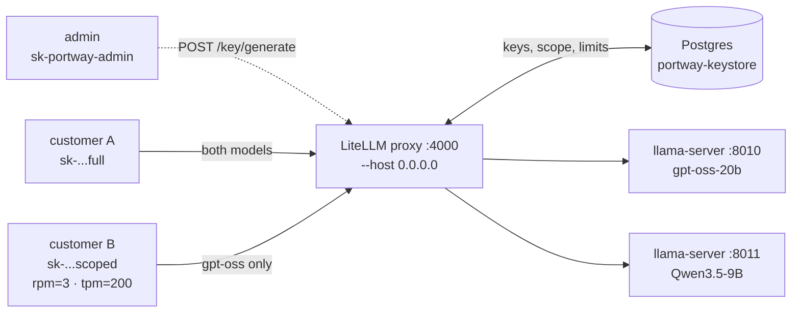

# Post 4 — Auth, API keys, and per-key model scoping

> Goal: turn the Post-3 gateway into a service. Mint customer-facing virtual keys backed by a real key store, each scoped to a subset of models and rate-limited on both requests/min and tokens/min. Still local, still $0.

This walkthrough is the concrete, runnable counterpart to Post 4 in [`series.md`](./series.md). It crosses the line between "my toy" and "a service" — and it's still entirely local.

← Previous: [Post 3 — The gateway: route by model name](./3%20-%20The%20gateway:%20route%20by%20model%20name.md) · ⤴ Start of series: [Post 1 — Local-first: a model on your own machine, zero cloud](./1%20-%20Local-first:%20a%20model%20on%20your%20own%20machine,%20zero%20cloud.md)



## What's in this post

- `4-auth/config.yaml` — extends Post 3's config with `database_url`, `store_model_in_db: false`, and a renamed `master_key` (`sk-portway-admin`) to signal its admin role.
- `4-auth/start-keystore.sh` — `start|stop|status` wrapper around a `postgres:16` Docker container (`portway-keystore`) on `:5432`.
- `4-auth/start-gateway.sh` — wraps `litellm --config ...` like Post 3, but refuses to start unless the keystore is reachable, and runs an idempotent `prisma generate` on first boot.
- `4-auth/demo.py` — five blocks:
  1. **Admin mints virtual keys:** master_key calls `POST /key/generate` three times — one full-access, one `gpt-oss`-scoped with `rpm=3`, one `gpt-oss`-scoped with `tpm=200`.
  2. **`/v1/models` reflects per-key scope:** the full key sees both models; the scoped key sees only `gpt-oss`.
  3. **Scope violation returns 403:** the scoped key tries `qwen3.5` and gets a clean `PermissionDeniedError`.
  4. **RPM limit trips 429:** four quick requests against the `rpm=3` key; the fourth returns `RateLimitError`.
  5. **TPM limit trips 429 pre-flight:** one oversized prompt against the `tpm=200` key; rejected at the gateway before reaching a backend.

## How this differs from Post 3

[Post 3](./3%20-%20The%20gateway:%20route%20by%20model%20name.md) had one master key in front of everyone — fine for a demo, useless for a service. Post 4 introduces per-customer credentials: the master key becomes the *admin* credential that mints, and `sk-...` virtual keys are what customers send. Each virtual key carries its own model allowlist and rate limits. This is the production shape — what OpenRouter, Anthropic, and OpenAI all do internally.

## Why Postgres (and our first Docker dependency)

Posts 1–3 were dependency-light: `uv` plus a couple of processes. Post 4 adds Postgres in a Docker container — the first real infrastructure piece of the series.

LiteLLM 1.86 *can* back virtual keys with SQLite, but Post 5's metering will need append-only volume that SQLite handles poorly. Standing up Postgres now front-loads a dep we'd need anyway, and avoids a migration mid-series. Post 8 (containerization) will lift this `docker run` into a proper `docker compose` service alongside the gateway.

The container is intentionally **ephemeral** — no volume mount. Demo keys carry `duration: "1h"` so nothing important lives in the DB across restarts. Post 5 adds durability when metering rows actually need to survive.

## Prerequisites

- Posts 1–3 working. In particular, `2-two-models/start-backends.sh` must run cleanly and both `:8010/v1/models` and `:8011/v1/models` respond.
- Docker daemon available (`docker ps` works without sudo).
- Port `5432` free. If you have a native macOS Postgres, `brew services stop postgresql@15` (or your version) before running the demo.
- Python `<3.14` and [uv](https://docs.astral.sh/uv/) installed — same as Post 3.

## Run it

From the repo root:

```bash
# 1. Backends from Post 2 (if not already running).
2-two-models/start-backends.sh
# Wait for "server is listening" in both 2-two-models/logs/*.log.

# 2. Postgres keystore.
4-auth/start-keystore.sh start
# First run pulls postgres:16 (~150 MB). Ends in "ready" when it's healthy.

# 3. Sync dependencies (first time only, picks up 4-auth/pyproject.toml).
uv sync

# 4. Gateway. First run also does `prisma generate` (one-time, ~10s).
4-auth/start-gateway.sh
# Tail with:  tail -f 4-auth/logs/gateway.log
# Stop with:  4-auth/start-gateway.sh stop

# 5. Once /v1/models on :4000 responds, run the demo.
uv run --project 4-auth python 4-auth/demo.py
```

## Sample output

_(Captured on this machine — M4 Pro Mac, 48 GB, LiteLLM 1.86.2, postgres:16, Python 3.13.)_

```text
============================================================
Block 0 — admin mints virtual keys
============================================================
full-access key:  …wyzQ  (models: gpt-oss, qwen3.5)
scoped key:       …sRtg  (models: gpt-oss; rpm=3)
tpm-test key:     …GHeg  (models: gpt-oss; tpm=200)

============================================================
Block 1 — /v1/models reflects per-key scope
============================================================
full-access   -> ['gpt-oss', 'qwen3.5']
scoped        -> ['gpt-oss']

============================================================
Block 2 — scoped key blocked on out-of-scope model
============================================================
status:  403
body:    {'message': "key not allowed to access model. This key can only access models=['gpt-oss']. Tried to access qwen3.5", 'type': 'key_model_access_denied', 'param': 'model', 'code': '403'}

============================================================
Block 3 — RPM limit trips 429
============================================================
  request 1: 200
  request 2: 200
  request 3: 200
  request 4: 429 (RateLimitError) — RPM tripped

============================================================
Block 4 — TPM limit trips 429 (pre-flight estimate)
============================================================
status:  429 (RateLimitError) — TPM tripped
body:    {'message': 'Rate limit exceeded for api_key: 18c19c8d... Limit type: tokens. Current limit: 200, Remaining: 200. Limit resets at: 2026-05-31 10:04:41 UTC', 'type': 'None', 'param': 'None', 'code': '429'}
```

**Worth staring at:**

- **Block 0** prints only the last four characters of each key. The full `sk-...` is returned by `/key/generate` exactly once — the DB stores a hash, not the key — so a log line that captures more than a tail is a credential leak.
- **Block 1** demonstrates scoping *before* a single chat call. A framework that calls `/v1/models` on startup (Continue.dev, Cursor, LangChain) will see only what the user's key allows. This is the right surface for tiering and product packaging.
- **Block 2's `type: key_model_access_denied`** is LiteLLM's machine-readable error code. Status is `403`; on older LiteLLM versions it can be `401` — the demo's `except (openai.AuthenticationError, openai.PermissionDeniedError)` catches both for version-tolerance.
- **Block 3's exact pattern** — three `200`s then a `429` — only works because the demo passes `max_retries=0` to the OpenAI client. By default the SDK retries 429s honoring LiteLLM's `Retry-After: 60` header, which makes the rate-limit *appear to work* (request eventually succeeds) and silently masks the trip. See "things that bit" #7.
- **Block 4** is a pre-flight rejection. The prompt never reaches a `llama-server`; LiteLLM's tokenizer estimates input tokens, sees the total would exceed `tpm_limit=200`, and 429s immediately. Useful guardrail at the gateway; surprising if you expected the rate-limit to trigger *after* the response.

## Definition of Done

- [x] Two customer keys issued, one scoped to `gpt-oss` only — Block 0 mints (three keys in practice; see "things that bit" #4 for why we needed a third), Block 1 proves scope via `/v1/models`.
- [x] The scoped key gets a clean 403 on `qwen3.5` — Block 2.
- [x] Exceeding RPM returns 429 — Block 3.
- [x] Exceeding TPM returns 429 — Block 4 (added beyond strict DoD per the series' "tokens/min, not just requests/min" principle).

## Things that bit, worth noting now

1. **Two roles, two keys.** `master_key` is what an *admin* sends to mint/revoke; virtual `sk-...` keys are what *customers* send to chat. Conflating them is the canonical first-day bug — already telegraphed in Post 3, now concrete: the `master_key` was renamed `sk-portway-admin` specifically to make this visible at a glance.
2. **Startup order is load-bearing.** Postgres must be reachable *before* the gateway starts — LiteLLM creates its schema on first init, and a connection error there is confusing because the proxy logs look like a normal startup until it crashes mid-migration. `start-gateway.sh` polls `docker exec pg_isready` before launching `litellm`.
3. **`store_model_in_db: false` is load-bearing too.** Forgetting it makes `/v1/models` return `[]` despite a fully-populated `model_list` in YAML — LiteLLM tries to load routes from the (empty) DB instead of from config. The error looks like "you misconfigured your routes" when in fact you misconfigured *where* LiteLLM reads them from.
4. **RPM and TPM tests can't share a key.** Once Block 3 trips RPM, that key is in cooldown for the rest of the minute — a follow-up TPM test would 429 on RPM, not TPM. The demo mints a **third** key (`tpm-test`) with loose RPM and tight TPM for Block 4. The DoD says "two keys" but you really want three for cleanly orthogonal demos.
5. **TPM is pre-flight estimated.** A prompt the backend would happily serve can be rejected at the gateway before it ever leaves the box (Block 4 demonstrates exactly this). LiteLLM uses tiktoken to estimate input tokens and rejects if `current + estimate > limit`. Correct behavior, but it surprises anyone expecting "rate limit triggered on response."
6. **Raw key shown once.** `/key/generate` returns the `sk-...` exactly once; the DB stores only a hash. Don't pipe demo output to a log you'll share — Block 0 deliberately prints only the last 4 chars for this reason.
7. **The OpenAI SDK silently retries 429s.** `OpenAI(...)` defaults to `max_retries=2` and honors LiteLLM's `Retry-After: 60` header. A `rpm_trip()` block that fires four quick requests *looks* like it works on first glance: requests 1–3 return 200, request 4 hangs for ~60s and then returns 200 too. The rate-limit never surfaced. Fix: pass `max_retries=0` to the client in any block that means to observe the 429. This is the single most likely cause of "my rate-limit test passed but my rate-limit is broken."
8. **`key_alias` is globally unique.** LiteLLM enforces uniqueness across the whole DB and returns `400 "Key with alias 'X' already exists"` on collisions. A demo that hardcodes aliases works on first run and fails on every subsequent one. `demo.py` suffixes each alias with `uuid.uuid4().hex[:8]` so replays don't collide. Worth knowing for any tool that mints keys with stable names.
9. **`litellm[proxy]` doesn't pull Prisma.** LiteLLM's DB layer uses Prisma, but installing `litellm[proxy]>=1.86` doesn't pull the `prisma` Python package or generate its client. Without `prisma`: `ModuleNotFoundError: No module named 'prisma'` at startup. With `prisma` but not generated: `Unable to find Prisma binaries. Please run 'prisma generate' first.` The fix is two-part: (a) add `prisma>=0.15` to `pyproject.toml`; (b) run `prisma generate --schema=<litellm_proxy_extras path>/schema.prisma` once. `start-gateway.sh` does this idempotently — on first boot you'll see `generating prisma client (one-time)...` and ~10s of delay; subsequent runs skip it.
10. **Duplicate `key_alias` and `key_alias` enforcement are stricter than the docs suggest.** Related to #8: even keys that have *expired* (past their `duration`) still occupy their alias in the DB. The uniqueness check is against the row, not against active state. The uuid-suffix trick sidesteps this entirely.
11. **Rate limits live at the gateway, not the backend.** A leaked key is still cheap to fingerprint by spamming — the auth check happens *before* the rate-limit check, so even a 401-returning probe consumes a tiny amount of gateway CPU. Not a problem for a local demo; relevant for Post 12's hardening pass.

## Side finding: the gateway is already LAN-ready

A small change to `start-gateway.sh` turns this from a localhost demo into a usable LAN endpoint for any other machine on your WiFi:

```diff
 uv run --project . litellm \
   --config config.yaml \
   --port 4000 \
-  --host 127.0.0.1 \
+  --host 0.0.0.0 \
   >logs/gateway.log 2>&1 &
```

That's it. With `0.0.0.0`, other devices on your LAN can hit `http://<your-mac-LAN-IP>:4000/v1` using the virtual keys minted in Block 0 (or via curl as in [§"What's next"](#whats-next) below). Verified live: a remote client on the same WiFi made twelve consecutive requests through the gateway → llama.cpp backends, mixed sizes from 69 to 17,646 prompt tokens, with these results:

- **Decode rate:** 54.4 ± 1.6 t/s — steady across all 12 requests, no degradation between small and large prompts.
- **Prefill rate:** ~220 t/s on small prompts (~80 tokens), rising to ~600 t/s on the 17K-token prompt as fixed overhead amortizes.
- **LAN/WiFi overhead:** below the noise floor. The backend-reported throughput (per `llama-server`'s `print_timing` lines) matched what the client perceived end-to-end. On a healthy LAN, gateway + backend metrics are the right numbers to quote.

Two caveats worth front-loading before you point real tooling at this:

- **`0.0.0.0` means everyone on your LAN can call it.** The virtual keys gate model access, but not network access. If your WiFi includes untrusted devices, bind to a specific interface or put the box behind a firewall before sharing keys.
- **The honest throughput number is a Post 7 concern, not Post 4's.** This block is an opportunistic measurement — sample of 12, no concurrency, no streaming — useful for sanity but not benchmarking. Post 7 formalizes TTFT, p95, and load characterization.

**Back-edit to Post 2.** Real chat clients send prompts well past Post 2's original `--ctx-size 8192` (the 12-request sample above included one 17,646-token prompt). Both `llama-server` invocations in `2-two-models/start-backends.sh` were bumped to `--ctx-size 131072` (128K, native max for both models) so the gateway can actually forward what clients send. Heads-up: 128K KV cache × 4 default slots × 2 co-located models is roughly 40 GB of memory in flight — fine on a 48 GB box, OOM on a 16 GB one. If you're on tighter hardware, pick a smaller number (32K covers most real prompts) or drop `--parallel 1`.

## What's next

Post 5 adds **metering** on top of this: every request through the gateway produces a row in a metering table (key, model, prompt/completion tokens, cost). The streaming-usage gotcha (`stream_options.include_usage`) lives there. The same Postgres container hosts both the key store (this post) and the metering table — and that's why we picked Postgres over SQLite.
