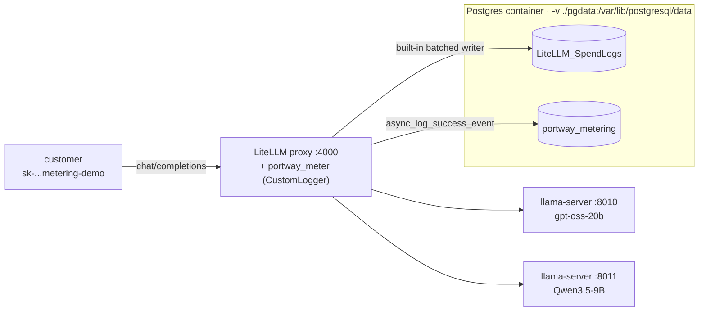

# Post 5 — Token tracking & metering

> Goal: every request through the Post-4 gateway now produces a row in two tables — LiteLLM's built-in `LiteLLM_SpendLogs` and our parallel `portway_metering` — capturing prompt/completion tokens and computed cost per key and model. The streaming `include_usage` trap is shown as a bug, then fixed. Still local, still $0.

This walkthrough is the concrete, runnable counterpart to Post 5 in [`series.md`](./series.md).

← Previous: [Post 4 — Auth, API keys, and per-key model scoping](./4%20-%20Auth,%20API%20keys,%20and%20per-key%20model%20scoping.md) · ⤴ Start of series: [Post 1 — Local-first: a model on your own machine, zero cloud](./1%20-%20Local-first:%20a%20model%20on%20your%20own%20machine,%20zero%20cloud.md)



## What's in this post

- `5-metering/config.yaml` — extends Post 4's config with `input_cost_per_token` / `output_cost_per_token` on each model and registers `portway_callback.portway_meter` under `litellm_settings.callbacks`.
- `5-metering/portway_callback.py` — a `CustomLogger` subclass with `async_log_success_event` / `async_log_failure_event` that writes one row per request to `portway_metering`. Idempotent `CREATE TABLE IF NOT EXISTS` on import.
- `5-metering/start-backends.sh` — local copy of Post 2's two-`llama-server` launcher (same as Post 4).
- `5-metering/start-keystore.sh` — same `start | stop | status` wrapper as Post 4, **plus** a `-v "$(pwd)/pgdata:/var/lib/postgresql/data"` volume mount so rows survive `docker restart`.
- `5-metering/start-gateway.sh` — same shape as Post 4 (refuses to start without keystore, runs `prisma generate` idempotently), but sets `PYTHONPATH=5-metering` so LiteLLM can import `portway_callback`.
- `5-metering/demo.py` — six blocks:
  0. Admin mints a `metering-demo` key with loose RPM/TPM (so the streaming/non-streaming blocks don't trip each other).
  1. Non-streamed `chat/completions` → `portway_metering` row with correct tokens and cost.
  2. **Streaming WITHOUT `include_usage` — the bug.** Final chunk has no `usage`; the resulting metering row has `completion_tokens=0`. Zero-billed traffic.
  3. **Streaming WITH `include_usage` — the fix.** The final empty-`choices` chunk carries `usage`; the metering row has correct non-zero tokens.
  4. `LiteLLM_SpendLogs` and `portway_metering` agree for the same `request_id`.
  5. The canonical billing query: `SUM(total_tokens), SUM(computed_cost) GROUP BY api_key_hash, public_model`.

## How this differs from Post 4

[Post 4](./4%20-%20Auth,%20API%20keys,%20and%20per-key%20model%20scoping.md) made keys, models, and rate limits real. Post 5 makes **cost** real. After this post, every request through the gateway is attributed to a key and model with prompt/completion tokens and a dollar value, and two independent tables agree on the number.

Mechanically, the Post-4 Postgres container gains a volume mount and a second table written by an in-process callback. The callback is a `CustomLogger` subclass — see "Things that bit" #1 for why the obvious sync-function shape silently doesn't work on the proxy's async path. Everything else (config, key mint flow, `database_url`, `store_model_in_db: false`) is unchanged from Post 4.

The pedagogical centerpiece is the streaming-usage trap. Blocks 2 and 3 sit side by side: same prompt, same model, one line of difference, and that one line is the difference between zero-billed and correctly-billed traffic. If you take one thing away from this post, take that.

## Why two tables?

`LiteLLM_SpendLogs` is the production source of truth. You don't have to do anything to get it — set `database_url` (already done in Post 4), set per-model prices in `config.yaml` (this post), and LiteLLM writes batched rows behind the scenes. In a real deployment, this is the table you bill from.

`portway_metering` is the teaching artifact. The schema is explicit in our code, the callback is wired up by hand, and Block 4 proves it agrees with `LiteLLM_SpendLogs` row-for-row — so we know the built-in is trustworthy. Standing up our own table also exercises the callback machinery that Post 11/13 will reuse for an async metering pipeline. In production, you'd ship one of these two, not both; here we keep both because the side-by-side comparison is the lesson.

## Prerequisites

- Posts 1–4 worked on your machine. Post 5 ships its own `start-backends.sh` and `start-keystore.sh` so this directory is self-contained.
- Docker daemon available, port `5432` free (stop any host Postgres), port `4000` free.
- Python `<3.14` and [uv](https://docs.astral.sh/uv/) installed.

## Run it

From the repo root:

```bash
# 1. Backends (same two llama-server processes as Posts 2 and 4).
5-metering/start-backends.sh
# Wait for "server is listening" in both 5-metering/logs/*.log.

# 2. Postgres keystore — same container as Post 4, now with -v ./pgdata mounted.
5-metering/start-keystore.sh start
# First run pulls postgres:16 if you don't have it; ends in "ready".

# 3. Sync dependencies (picks up 5-metering/pyproject.toml: openai, httpx, psycopg[binary]).
uv sync

# 4. Gateway. PYTHONPATH=5-metering so LiteLLM can import portway_callback.
5-metering/start-gateway.sh
# Tail with:  tail -f 5-metering/logs/gateway.log
# Stop with:  5-metering/start-gateway.sh stop

# 5. Once /v1/models on :4000 responds, run the demo.
uv run --project 5-metering python 5-metering/demo.py
```

## Sample output

_(Captured on this machine — M-series Mac, LiteLLM 1.86.2, postgres:16, Python 3.13.)_

```text

============================================================
Block 0 — admin mints a metering-demo key
============================================================
metering-demo key: …zNoA  (models: gpt-oss, qwen3.5)

============================================================
Block 1 — non-streamed request → metering row
============================================================
  request_id: chatcmpl-RTlHGd7K2XjsF5gi1bnQS6kSlSGdBdlU
  usage:      {'completion_tokens': 20, 'prompt_tokens': 72, 'total_tokens': 92, 'completion_tokens_details': None, 'prompt_tokens_details': {'audio_tokens': None, 'cached_tokens': 60}}
  public_model       gpt-oss
  prompt_tokens      72
  completion_tokens  20
  total_tokens       92
  computed_cost      0.00001380
  status             success
  total_latency_ms   437

============================================================
Block 2 — streaming WITHOUT include_usage → the BUG
============================================================
  request_id:    chatcmpl-hZXccddAnNYHWDBiDhFyt4ZclR1xQLEp
  chunks_seen:   29
  content:       ''
  usage in any chunk?  no  (we never asked for it)
  metering row this produced:
  public_model       gpt-oss
  prompt_tokens      11
  completion_tokens  0
  total_tokens       11
  computed_cost      0.00001785
  status             success
  total_latency_ms   583

  *** zero-billed stream — this is the trap. ***
  Fix in Block 3: stream_options={'include_usage': True}

============================================================
Block 3 — streaming WITH include_usage → the FIX
============================================================
  request_id:    chatcmpl-CA3EgnuNNa3c4PHD9EG8O34jfqt8CVOI
  chunks_seen:   30
  content:       ''
  final usage:   {'completion_tokens': 30, 'prompt_tokens': 71, 'total_tokens': 101, 'completion_tokens_details': {'accepted_prediction_tokens': None, 'audio_tokens': None, 'reasoning_tokens': 27, 'rejected_prediction_tokens': None}, 'prompt_tokens_details': {'audio_tokens': None, 'cached_tokens': 60}}
  metering row this produced:
  public_model       gpt-oss
  prompt_tokens      71
  completion_tokens  30
  total_tokens       101
  computed_cost      0.00001965
  status             success
  total_latency_ms   584

============================================================
Block 4 — LiteLLM_SpendLogs vs portway_metering agree
============================================================
  comparing request_id: chatcmpl-CA3EgnuNNa3c4PHD9EG8O34jfqt8CVOI
  waiting for SpendLogs batch flush ...

  LiteLLM_SpendLogs:
    model=openai/gpt-oss  spend=0.00001965  tokens=101 (in=71, out=30)
  portway_metering:
    model=gpt-oss  cost =0.00001965  tokens=101 (in=71, out=30)

  agreement: matched (tokens + cost)

============================================================
Block 5 — spend grouped by key + model
============================================================
  api_key_hash       model       reqs   tokens        spend
  0c8d405242687615   gpt-oss        3      204 $ 0.00005130
```

**Worth staring at:**

- **Block 1's `computed_cost` math.** 72 prompt tokens — but 60 of them were cached (`prompt_tokens_details.cached_tokens=60`), so LiteLLM bills 12 non-cached input tokens at $0.15/M and 20 output tokens at $0.60/M: `12 × 1.5e-7 + 20 × 6e-7 = 1.8e-6 + 1.2e-5 = 1.38e-5`. That's exactly the `0.00001380` in the row. Cached-token pricing is honored automatically when the backend reports it.
- **Block 2 vs Block 3 — the headline.** Same prompt, same gateway, same model. Block 2 (no `include_usage`) reports `completion_tokens=0`. Block 3 (`include_usage=True`) reports `completion_tokens=30`. The one-line SDK option is the difference between a free ride and a billed request.
- **Block 2's row is internally inconsistent and that's the point.** `completion_tokens=0` but `computed_cost=0.00001785` ≈ 119 input tokens × $0.15/M. LiteLLM computed cost against the full prompt while `usage` only carried the 11-token reasoning fragment. Don't trust *any* number from a stream without `include_usage`.
- **`content: ''` in Blocks 2 and 3 is gpt-oss, not a bug.** All 30 completion tokens in Block 3 were reasoning (`reasoning_tokens: 27`) plus a couple of structural tokens. The demo prompts are short on purpose; the streamed visible content is empty but the tokens are real and billed.
- **Block 4's agreement is row-for-row, not approximate.** Same `request_id` (`chatcmpl-CA3Eg...`), same tokens (101 = 71 in + 30 out), same spend (`0.00001965`). The `model` column differs by prefix only — LiteLLM stores the upstream model id (`openai/gpt-oss`) while our callback stores the public alias (`gpt-oss`). Worth verifying once that the join works; you'll trust SpendLogs after that.
- **Block 5 is the invoice query.** `GROUP BY api_key_hash, public_model` plus `SUM(total_tokens), SUM(computed_cost)` is what a billing job runs at the end of a billing period. The fact that it's one boring SQL statement is the goal.

## Persistence check (the volume mount)

The whole reason Post 5 added `-v "$(pwd)/pgdata:/var/lib/postgresql/data"` is so this works:

```bash
docker restart portway-keystore
docker exec portway-keystore psql -U postgres -d portway -c \
  "SELECT COUNT(*) FROM portway_metering;"
#  count
# -------
#      3
```

Three rows before the restart, three rows after. Delete `5-metering/pgdata/` and `docker rm -f portway-keystore`, then re-run `start-keystore.sh start`, and the table is gone — the difference between the mount working and not.

## Definition of Done

- [x] A streamed request produces a metering row with correct non-zero tokens and a computed cost — Block 3.
- [x] A non-streamed request produces a metering row with correct non-zero tokens and a computed cost — Block 1.
- [x] Can `SELECT` spend grouped by key and model — Block 5.
- [x] A streamed request **without** `include_usage` is demonstrably zero-billed — Block 2.
- [x] `LiteLLM_SpendLogs` and `portway_metering` agree on tokens + cost for the same `request_id` — Block 4.
- [x] Rows survive `docker restart portway-keystore` — manual check above.

## Things that bit, worth noting now

1. **Sync function callbacks DO NOT FIRE on the proxy's async path.** LiteLLM 1.86's proxy is async (`acompletion` under the hood). Registering a plain `def portway_meter(kwargs, response_obj, start_time, end_time): ...` via `success_callback: ["portway_callback.portway_meter"]` registers cleanly at boot — it even shows up in the `Initialized Success Callbacks` log line — and then silently never gets invoked. The fix is to subclass `litellm.integrations.custom_logger.CustomLogger`, override `async_log_success_event` and `async_log_failure_event`, and register an *instance* via `litellm_settings.callbacks: ["portway_callback.portway_meter"]` where `portway_meter` is the instance, not a function. This was the single biggest gotcha of the entire post.
2. **`callbacks:` vs `success_callback:` — when each is right.** `success_callback:` takes a module-path to a sync function and is for non-proxy SDK use only. `callbacks:` takes a module-path to a class instance and *must* point at a `CustomLogger` subclass — the proxy expects that interface. The error you get from putting a plain function under `callbacks:` is the misleading `'function' object has no attribute 'async_post_call_success_hook'`. If you see that, you've hit this. (We did, during Task 6 verification.)
3. **The streaming-usage trap itself.** Without `stream_options={"include_usage": True}`, the upstream OpenAI-compatible API never emits a usage chunk and the gateway has no token count to meter. Your most expensive traffic — streamed chat completions — bills as zero. Set `include_usage` on every streaming call. This is the headline finding of the post.
4. **The `include_usage` chunk has empty `choices`.** When you turn the flag on, the *final* chunk in the stream has `choices=[]` and a populated `usage`. A naïve `for chunk in stream: print(chunk.choices[0].delta.content)` raises `IndexError` on that last chunk. Guard with `if chunk.choices: ... elif chunk.usage: final_usage = chunk.usage`.
5. **`Initialized Success Callbacks` in the gateway log lies about CustomLogger.** When you register a `CustomLogger` instance via `callbacks:`, the boot line logs the instance, but per-invocation there is no log line by default — `grep callback gateway.log` returns nothing even though the callback is firing. Don't take the absence of logs as evidence that nothing's running; check the table.
6. **SpendLogs writes are batched, ~5–15s after the request.** Our `portway_metering` rows are synchronous (the callback runs in the request path), but `LiteLLM_SpendLogs` is buffered and flushed in the background. A `SELECT` against `LiteLLM_SpendLogs` immediately after a chat completion will return nothing. Block 4 polls for up to ~15s before comparing.
7. **`request_id` in both tables is the OpenAI response id (`chatcmpl-...`), not `x-litellm-call-id`.** The `x-litellm-call-id` header is a separate UUID that LiteLLM also tracks; do not confuse them. The plan originally said to read the header, but the working code reads `completion.id` from the response body. Joining `LiteLLM_SpendLogs` and `portway_metering` on `request_id` works because both store `response_obj.id`.
8. **`response_cost` lives in `kwargs`, not `response_obj`.** LiteLLM attaches the computed dollar value via `kwargs["response_cost"]`. Reading `response_obj` for cost gives you `None` and a row of `$0.00` even when token counts are correct. The callback always reads cost from `kwargs`.
9. **Token counts and cost can disagree inside a single zero-billed row.** Block 2's row has `completion_tokens=0` but `computed_cost=0.00001785`. The cost figure was computed against the full ~119-token prompt while `usage` only carried the 11-token reasoning fragment. The lesson isn't to fix this — it's to refuse to trust *any* number from a stream without `include_usage`, including the cost.
10. **Meter from the backend's `usage`, never from your own count.** `len(text)/4`, tiktoken, character counting — all wrong. The backend tokenizer is the only authority on what was actually tokenized. That's *why* the streaming trap matters: it cuts off your only authoritative source of truth.
11. **Failures still need a metering row.** A 4xx/5xx response has zero tokens but the row should exist (with `status="failure"`) for forensics and abuse detection. `async_log_failure_event` is registered alongside the success hook for exactly this reason.
12. **`computed_cost` precision: `NUMERIC(12,8)`, not `FLOAT`.** Token counts are integers; prices are 10⁻⁷-scale decimals. Float-typed columns accumulate rounding error when you `SUM()` across a billing period. Use `NUMERIC` with enough scale and never go back.
13. **`api_key_hash`, never raw keys.** Same principle as Post 4 (`/key/generate` returns the key once; the DB stores a hash). The metering row stores last-4 + a sha256 prefix — identifiable enough for support tickets, never enough to impersonate.
14. **The callback runs in the request path.** A slow `INSERT` adds latency to every chat completion. Keep the connection short-lived, `autocommit=True`, one row per call, and `ON CONFLICT (request_id) DO NOTHING` so retries don't double-bill. LiteLLM also supports queued/async callbacks; we use a per-call connection here for clarity and document the trade-off — Post 11/13 swaps in a proper async pipeline.
15. **Volume-mount paths are uid-sensitive on Linux.** `./pgdata` works out of the box on Docker Desktop (Mac/Windows). On native Linux you may need matching UIDs, `:z`/`:Z` SELinux relabels, or `--user $(id -u):$(id -g)`. The walkthrough is Mac-first; Linux users should consult the `postgres` image's UID notes if the container won't start.
16. **Prices in the post are illustrative.** `$0.15 / $0.60` per million input/output tokens is gpt-4o-mini-shaped — chosen so the demo `SUM()` produces a readable number. Real local cost is amortized hardware + electricity, which is a Post 13 conversation. The numbers in Block 5 are not what your gpt-oss inference actually costs you to run.

## Bonus: the admin UI Usage tab now works

Post 4 noted that LiteLLM's bundled admin UI at `http://127.0.0.1:4000/ui/` had a populated **Virtual Keys** tab but an empty **Usage** tab — nothing was writing spend rows. Post 5 fixes that. Log in (username `admin`, password = your `master_key` or the separate `ui_password` if you set one per Post 4 "things that bit" #14), and the Usage tab now shows per-key spend, request counts, and latency drawn from the same `LiteLLM_SpendLogs` rows that Block 4 reads.

The UI is just a view on top of the table you just learned to query. Nothing the UI shows is unavailable to `psycopg`; nothing the UI hides is hidden from you. Post 12 turns this into a real multi-tenant dashboard with teams and budgets.

## What's next

Post 6 adds **conversation state**: a thread store so multi-turn chats survive process restarts, scoped per key, with the same Postgres container holding keys, metering, and threads side by side. We have the cost story now — the next thing customers expect is for the assistant to remember what they said.
