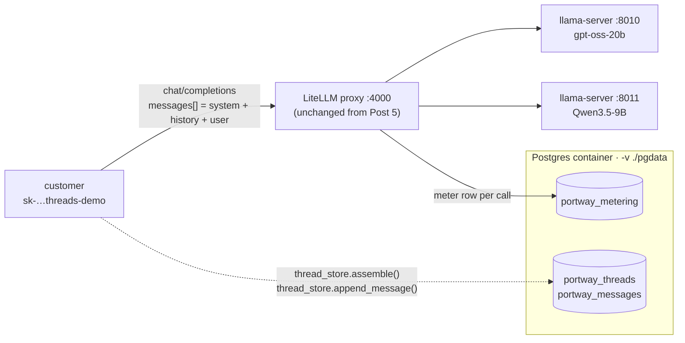

# Post 6 — Conversation state & context management

> Goal: build a thin app-side thread store and prove the inference layer remains stateless. Each turn loads history from Postgres, sends the full `messages[]` to the gateway, and appends the new pair. Two overflow strategies (truncate and summarize) keep a 50-turn thread under a chosen budget. The gateway is unchanged from Post 5; threads are an application concern.

This walkthrough is the concrete, runnable counterpart to Post 6 in [`series.md`](./series.md).

← Previous: [Post 5 — Token tracking & metering](./5%20-%20Token%20tracking%20&%20metering.md) · ⤴ Start of series: [Post 1 — Local-first: a model on your own machine, zero cloud](./1%20-%20Local-first:%20a%20model%20on%20your%20own%20machine,%20zero%20cloud.md)



## What's in this post

- `6-threads/start-backends.sh` — local copy of Post 2's two-`llama-server` launcher (same as Posts 4 and 5).
- `6-threads/start-keystore.sh` — local copy of Post 5's Postgres launcher (same `-v ./pgdata` mount).
- `6-threads/start-gateway.sh` — local copy of Post 5's gateway launcher (`PYTHONPATH=6-threads` so LiteLLM can import `portway_callback`).
- `6-threads/config.yaml` — same as Post 5: per-model pricing and the metering callback are still wired up.
- `6-threads/portway_callback.py` — byte-for-byte copy of Post 5's `CustomLogger`. The gateway path is untouched in this post.
- `6-threads/pyproject.toml` — same deps as Post 5 (`psycopg`, `openai`, `httpx`, `litellm[proxy]`, `prisma`). No new packages.
- `6-threads/thread_store.py` — **new**: two tables (`portway_threads`, `portway_messages`), idempotent `CREATE TABLE IF NOT EXISTS` on first use, and five small functions: `create_thread`, `append_message`, `load_messages`, `set_summary` / `get_summary`, `assemble(strategy, budget_tokens, completion_reserve)`. `assemble` is the only function with real logic — see "How assembly works" below.
- `6-threads/demo.py` — **new**: five blocks plus a key-mint block.
  0. Admin mints a `threads-demo` key.
  1. Ten-turn chat against `gpt-oss`. `prompt_tokens` grows turn over turn because we resend the whole history — the cleanest signal that the backend keeps no per-client session.
  2. Cache + stateless control: warm thread (turn 11 of Block 1, full prefix in KV) vs cold thread (fresh `thread_id`, identical final question). `cached_tokens` and the model's reply tell two stories in one block.
  3. **Overflow via truncation.** 50 synthesized turns; `assemble(strategy="truncate", budget_tokens=800)` keeps system + the most recent pairs that fit.
  4. **Overflow via summarization.** Same 50 turns; call `qwen3.5` through the gateway to compress the older 40, store the summary on the thread, and `assemble(strategy="summarize", budget_tokens=800)` injects it as a second system message.
  5. Persistence + metering tie-in. `SELECT` from `portway_threads` shows the run's four threads; `SELECT` from `portway_metering` shows the row Block 4's summarization call produced.

## How this differs from Post 5

[Post 5](./5%20-%20Token%20tracking%20&%20metering.md) made cost real: every gateway call writes a row to `LiteLLM_SpendLogs` and `portway_metering`. Post 6 adds **the application's memory of what was said** — without touching the gateway. The gateway, the metering callback, and the price table are byte-identical to Post 5. The only new code is `thread_store.py` and a demo that exercises it.

The shape that matters is this: **the inference layer (gateway + backends) never sees a `thread_id`**. It receives an OpenAI-standard `messages[]` array, returns a completion, and forgets. The thread store lives entirely on the application side. Swapping in a different gateway, or a different backend, or running the same code against an external provider, wouldn't require changing a line of `thread_store.py`. That separation is what "stateless backends" actually means in code.

The metering callback from Post 5 keeps writing rows for every gateway call — including Block 4's summarization call. That tie-in is in Block 5: a `SELECT` proves the summarize call is just another billable request.

## How assembly works

`assemble(thread_id, system_prompt, user_message, strategy, budget_tokens, completion_reserve)` returns the `messages[]` to send next. The shape is always:

```text
[system, (summary-as-system if "summarize" and summary present), ...recent history that fits, user_message]
```

Budget arithmetic, in order:

1. Start with `available = budget_tokens - completion_reserve`.
2. Subtract the estimated tokens for the system prompt and the in-flight user message.
3. If `strategy == "summarize"` and the thread has a stored summary, subtract its estimated tokens too.
4. Walk `portway_messages` newest-first; for each row, add its `tokens` value (or `len(content)//4` if `tokens` is NULL) to a running total. Stop as soon as adding the next row would exceed `available`.
5. Reverse the kept list back to chronological order; append the user's new message; prepend the system frame.

The tokens column for stored messages is populated from the backend's `usage` whenever we have it (per Post 5's "trust the backend tokenizer" rule). For synthesized rows or messages we haven't sent yet we fall back to `len/4` — fine for *budgeting* the assembly, never used for *billing*.

## Two strategies, one shape

- **Truncate.** Cheapest possible. Drop oldest pairs first; keep system + recent + new user. Loses information; preserves nothing about what was dropped.
- **Summarize.** Spend one extra LLM call to compress the dropped material into a short note, store it on `portway_threads.summary`, and inject it as a system message. The next turn "feels continuous" to the assistant even though the original tokens are gone.

The series.md outline lists RAG as a third strategy. That's a separate post — once you're externalizing context to a vector store, retrieval, chunking, and embedding-model choice each need their own treatment. Post 6 stops at summarize.

## Why two `system` messages in the summarize path?

When summarize fires, `assemble` returns `[system, system-with-summary, ...recent, user]`. Two `system` rows is OpenAI-spec valid and is the simplest place to put a summary: it doesn't pretend the summary is a real user/assistant turn, and the model is trained to weight system content as instruction. Alternatives — embedding the summary inside the main system prompt, or as a fake `assistant` turn — work too; this one is the easiest to read in the SQL.

## Prerequisites

- Posts 1–5 worked on your machine. Post 6 ships its own copies of every script so this directory is self-contained.
- Docker daemon available, port `5432` free, port `4000` free.
- Python `<3.14` and [uv](https://docs.astral.sh/uv/) installed.

## Run it

From the repo root:

```bash
# 1. Backends (same two llama-server processes as Posts 2, 4, and 5).
6-threads/start-backends.sh
# Wait for "server is listening" in both 6-threads/logs/*.log.

# 2. Postgres keystore — same container as Post 5 (-v ./pgdata mounted).
6-threads/start-keystore.sh start

# 3. Sync dependencies.
uv sync --project 6-threads

# 4. Gateway. PYTHONPATH=6-threads so LiteLLM can import portway_callback.
6-threads/start-gateway.sh
# Tail with:  tail -f 6-threads/logs/gateway.log
# Stop with:  6-threads/start-gateway.sh stop

# 5. Once /v1/models on :4000 responds, run the demo.
uv run --project 6-threads python 6-threads/demo.py
```

## Sample output

_(Captured on this machine — M-series Mac, LiteLLM 1.86.2, llama.cpp `b6...`, postgres:16, Python 3.13.)_

```text

============================================================
Block 0 — admin mints a threads-demo key
============================================================
threads-demo key: …-dWA  (models: gpt-oss, qwen3.5)

============================================================
Block 1 — 10-turn chat; prompt_tokens grow because we resend history
============================================================
  thread_id: thr-trip-dbbb5231

  turn  prompt_tok   compl_tok  reply (first 60 chars)
     1         116          65  Hi!
     2         142         259  Consider British Columbia for its Pacific Coast and Okanagan
     3         193          74  Don’t miss Montreal for its vibrant culture and Quebec City
     4         235         166  Try poutine—crispy fries topped with cheese curds and rich b
     5         272         122  About 11 °C average (high ≈ 15 °C, low ≈ 7 °C).
     6         312          65  Stay in the Plateau‑Mont-Royal. It’s lively, pedestrian‑frie
     7         361         103  English is widely spoken in Montreal, especially in tourist
     8         407          84  Take a scenic bike ride along the Lachine Canal—autumn color
     9         454         148  Head to Mont Tremblant (≈ 1 h drive). Walk the old village,
    10         518          62  You mentioned traveling in **October**.

  *** prompt_tokens grows each turn because we resend the whole history.
      If the server held a session, prompt_tokens would stay roughly flat.
      Block 2's cold thread is the negative control: same question with no
      history sent shows the model can't recover the earlier context.

============================================================
Block 2 — prefix cache + stateless control: warm vs cold same probe
============================================================
  probe: 'Recap our plan in one sentence.'

                            cold thread    warm thread
  prompt_tokens                     111            544
  cached_tokens                      96            519
  ttft                            212ms          297ms
  total_latency                   3139ms          5309ms

  cold reply: 'I don’t have a plan to recap based on the information shared.'
  warm reply: 'In October, you’ll spend 10 days in Montreal, staying in the Plateau, enjoying poutine, biking the Lachine Canal, and ta'

  *** Two readings in one block:
      • Cache: warm cached_tokens >> cold cached_tokens — the 10-turn
        prefix is reused; the cold thread only shares the system bytes.
      • Stateless: cold can't recap a plan it was never told. The server
        kept nothing between threads.

============================================================
Block 3 — 50-turn thread, truncate to fit budget=800
============================================================
  full thread in DB:           50 messages, ~3611 tokens
  budget (OVERFLOW_BUDGET):    800 tokens (minus 512 reserve)
  assembled (truncate):        4 messages (system + 2 recent + new user)
  call prompt_tokens:          233
  reply:                       **Ontario** – vibrant hockey culture, iconic arenas like Maple Leaf Gardens, easy travel routes, and welcoming for first‑time visitors.

  *** Naive 'send everything' would have shipped the full thread.
      assemble(truncate) kept only the most-recent pairs that fit.

============================================================
Block 4 — same 50-turn shape, but summarize older turns via qwen3.5
============================================================
  summary call request_id:  chatcmpl-SMzGwsDFECWMLA95LRrHIqTh0OhwXqH2
  summary tokens:           in=2377 out=800
  summary (stored):         Thinking Process:

1.  **Analyze the Request:**
    *   Task: Compress the provided conversation into 4 short bullet points.
    *   Constraint 1: Preserve the user's preferences.
    *   Constraint 2…
  assembled (summarize):    4 messages (system×2 + user×1 + assistant×1)
  call prompt_tokens:       208
  reply:                    **Ontario** – easy access, vibrant cities (Toronto), natural parks (Niagara, Algonquin), cultural mix, and beginner‑friendly attractions make it ideal for first

  *** The summary lives in portway_threads.summary; assemble() injects
      it as a second system message. The summarization call itself
      produced a portway_metering row — see Block 5.

============================================================
Block 5 — thread persistence + metering tie-in
============================================================
  threads owned by this run's key hash (692de91d8cd2ccfa):
  thread_id                 msgs summary?                 created_at
  thr-trip-dbbb5231           22       no        2026-06-02 04:20:11
  thr-cold-950109d7            2       no        2026-06-02 04:20:40
  thr-50turn-6877b4ef         52       no        2026-06-02 04:20:43
  thr-50sum-9e9e6d51          52      yes        2026-06-02 04:20:48

  most recent qwen3.5 metering row (from Block 4's summarize call):
    request_id:        chatcmpl-SMzGwsDFECWMLA95LRrHIqTh0OhwXqH2
    public_model:      qwen3.5
    prompt_tokens:     2377
    completion_tokens: 800
    computed_cost:     $0.00032040

  threads persist across `docker restart portway-keystore` because
  pgdata is volume-mounted (carried over from Post 5).
```

**Worth staring at:**

- **Block 1's `prompt_tokens` column is the stateless proof.** It grows monotonically from 116 (turn 1: system + first user message) to 518 (turn 10: system + nine full pairs + the new user message). If the backend held a session, the gateway would only need to send the *delta* each turn and `prompt_tokens` would stay roughly flat. We send the whole history every time because we have to — the server's KV cache is a *cache*, never *state*. The "October." answer at turn 10 is correct only because we re-included turns 1–9.
- **Block 2's `cached_tokens` is the cache proof.** Cold thread sees 96 tokens cached — that's just the system prompt, which gets reused across requests as an artifact of llama.cpp's slot management. Warm thread sees 519 cached — the entire 10-turn prefix from Block 1's last call. *That* is what prefix caching looks like working. (The system-prompt-only carryover for cold is a useful side-lesson: even "fresh" requests can show non-zero cached tokens if you reuse the same system prompt, which everyone does.)
- **Block 2's `ttft` is noisier than `cached_tokens` and that's honest.** Warm's TTFT is *slightly higher* than cold's here (297 ms vs 212 ms). On a quiet Mac laptop with prompts in the low hundreds of tokens, the cache savings on the prefill matmul disappear into per-call scheduling overhead — and warm has a longer prefix to walk through anyway. The cache benefit is unambiguous in the `cached_tokens` column; in TTFT it shows up only at scale or with much longer prefixes. Don't claim a TTFT win the data doesn't support.
- **Block 2's two replies are the stateless proof in prose.** Warm gets a substantive 10-turn recap; cold says "I don't have a plan to recap based on the information shared." Same model, same system prompt, same final question. The difference is what the *client* chose to put in `messages[]`. If you ever want to feel in your bones that the server isn't holding context, read these two lines next to each other.
- **Block 3 cut 50 messages down to 2 of recent history (4 total messages in the call).** Total in DB ≈ 3611 tokens; available budget after the 512-token completion reserve and the system/user overhead is roughly 250 tokens. Only the most recent assistant/user pair fits. The call still produced a substantive answer ("Ontario — vibrant hockey culture…") because the *recent* turns are the ones that frame the question best. That's not always true; a truncate strategy throws away the user's preferences from turn 1.
- **Block 4 trades a token bill for a richer assembly.** The qwen3.5 call cost 2377 input + 800 output tokens ($0.000320) and produced a summary stored on the thread. The follow-up gpt-oss call then sees `[system, system-with-summary, assistant, user]` — four messages, 208 prompt tokens — instead of just the two-pair tail. The reply ("Ontario — easy access, vibrant cities (Toronto), natural parks (Niagara, Algonquin)…") reflects the earlier discussion of Canadian topics that truncate would have dropped. Summarize isn't free, but it preserves intent across the gap.
- **The `summary (stored)` value in Block 4 says "Thinking Process: …".** That's not a bug, it's [#3 in "Things that bit"](#things-that-bit-worth-noting-now): the summarization model emitted everything into `reasoning_content` and our fallback put a truncated copy of that into the summary slot. Imperfect, but the subsequent gpt-oss call still produced a coherent answer from it.
- **Block 5's metering row matches Block 4's `request_id` exactly.** `chatcmpl-SMzGwsDFECWMLA95LRrHIqTh0OhwXqH2` is the same id in both places. This is the Post-5 invariant rolling forward: every gateway call — including application-internal calls like summarization — produces a metering row.

## Persistence check (still the same volume mount)

Post 5's `-v "$(pwd)/pgdata:/var/lib/postgresql/data"` already gives us this for free. The new tables live in the same volume:

```bash
docker restart portway-keystore
docker exec portway-keystore psql -U postgres -d portway -c \
  "SELECT thread_id, (SELECT COUNT(*) FROM portway_messages m WHERE m.thread_id = t.thread_id) AS n
   FROM portway_threads t ORDER BY created_at DESC LIMIT 4;"
```

Same four threads before and after the restart. Threads outliving the inference container is exactly the point: history is the application's, not the model's.

## Definition of Done

- [x] A 10-turn chat demonstrates no server session (stateless) — Block 1's monotonically growing `prompt_tokens` plus Block 2's cold reply ("I don't have a plan to recap…") prove it from two angles.
- [x] Prefix caching makes late turns cheaper than cold turns — Block 2 shows 519 cached tokens warm vs 96 cold, against an identical final user message.
- [x] An overflow strategy keeps a 50-turn thread under `max-model-len` — Blocks 3 (truncate) and 4 (summarize) both fit the assembled call inside `OVERFLOW_BUDGET_TOKENS = 800`.
- [x] Thread store survives `docker restart portway-keystore` — same `pgdata` volume mount as Post 5.

## Things that bit, worth noting now

1. **The KV cache is per-slot and gets evicted by the next unrelated request.** llama.cpp's default `--parallel 1` means there's one cache slot. If you run a "control" request between your warm-thread build-up and your warm-thread measurement, the control's prefix evicts the trip thread's slot and your `cached_tokens` reads back as roughly the system-prompt size. The earliest draft of `demo.py` had a Block 1b control call between Block 1 and Block 2 and produced exactly this artifact (warm cached ≈ 96, indistinguishable from cold). The fix is ordering: build warm, measure warm, *then* measure cold. There is no other state to manage — that's the whole story of the slot.
2. **Empty `message.content` from a reasoning-format model is not an error.** With `--reasoning-format auto` (Post 5 carries this forward from Post 2), llama.cpp routes the model's thinking into `message.reasoning_content` and only the final answer into `message.content`. If `max_tokens` is too small, the entire budget is consumed by reasoning and `.content` arrives empty. For gpt-oss the cure is `extra_body={"reasoning_effort": "low"}` plus a generous `max_tokens` (1024 here for short answers). LiteLLM's `drop_params: true` silently strips `reasoning_effort` for models that don't support it, so it's safe to leave in.
3. **Qwen3.5 with `--reasoning-format auto` does not respect `/no_think` reliably.** Block 4's summarization call sets `reasoning_effort: low` (dropped by LiteLLM for qwen3.5) and prepends `/no_think` to the system prompt; the model still emits 800 tokens of `reasoning_content` and 0 tokens of `.content`. The demo falls back to using a truncated copy of `reasoning_content` as the summary, which is good enough for the assembly step downstream but is visibly the model's chain-of-thought rather than a clean four-bullet summary. The pragmatic fix in a real product: switch the summarizer to a non-reasoning model, or post-process the reasoning trace to extract the final answer. The honest fix: don't conflate "model exists" with "model is good at the task you wired it to."
4. **`TTFT` improves *less* than you'd expect on small prompts even with a big `cached_tokens` win.** Block 2's warm TTFT is higher than cold's despite reusing 519 cached tokens. Prefill of the cached portion still costs lookup + KV slot bookkeeping, the model still has to read the uncached suffix, and on a Mac laptop these scheduling costs swamp the matmul savings on a sub-1k-token prompt. The cache benefit grows with prefix length and request rate; on a single quiet request, `cached_tokens` is the trustworthy column.
5. **Storing `tokens` per-message has to come from the backend `usage`, not estimation.** The backend's response only gives you `prompt_tokens` (total) and `completion_tokens` (the reply). Per-row prompt tokens for the *user* message specifically aren't broken out, so `portway_messages.tokens` is populated only for assistant messages (where we know the row's exact completion-token count). The user rows get `NULL`, and `assemble` falls back to `len/4` for them. This is fine because we only use `tokens` for *budget arithmetic*, never for billing — Post 5 already established that billing reads `usage` at call time.
6. **The "tokens" column is the *post*-write tally; assemble works against an estimate for the *current* user message.** Until the call returns, you don't know `prompt_tokens` for the about-to-be-sent message. `_est_tokens(user_message)` returns `max(1, len(text)//4)` for the budget check and that's accepted as imprecision: an over-estimate truncates one extra turn from history, never a correctness bug.
7. **Two `system` messages is OpenAI-spec valid and the simplest summary slot.** `assemble(strategy="summarize")` emits `[system, system-with-summary, …history, user]`. Some chat templates concatenate consecutive `system` roles; others present them as two messages; both work. The temptation to inject the summary as a fake `assistant` turn or to splice it into the first system message both leak information about the assembly into the conversation — keep it explicit.
8. **A summary that grows to history-length defeats the point.** In one run the qwen3.5 summarizer emitted 800 tokens of reasoning_content; if we'd stored all of it as the summary, the assembly's available budget would have been entirely consumed by the summary and zero history would have fit (which we saw before adding the 400-character cap). The cap is a safety belt — in production you'd target a budget for the summary too, not just for the messages it replaces.
9. **`assemble` newest-first is the only sane walk order.** Walking oldest-first and stopping when the budget runs out keeps the *beginning* of the conversation, which is the part that's least likely to be relevant to the current turn. Newest-first keeps the *tail*, which is what the user just said. Both are wrong sometimes — that's why summarize exists — but newest-first is right more often.
10. **`api_key_hash` on the thread row, not raw keys (still).** `portway_threads.api_key_hash` matches the same hashing convention as `portway_metering.api_key_hash` from Post 5: first 16 chars of LiteLLM's `token_id` (a sha-256 prefix). This lets a customer's threads, spend rows, and SpendLogs rows all `JOIN` on the same identifier without ever storing the raw `sk-…`. `org_id` arrives in Post 12 when teams become a first-class concept; until then `api_key_hash` *is* the tenant key.
11. **`portway_messages` deletes cascade from `portway_threads`.** `ON DELETE CASCADE` on the foreign key means `DELETE FROM portway_threads WHERE …` cleans up the message rows too. The schema also covers idx-collisions: a race between two concurrent `append_message` calls on the same thread would violate the `(thread_id, idx) PRIMARY KEY`. In a real product you'd serialize appends per thread; the demo runs sequentially so it's not exercised.
12. **`/v1/models` still lists exactly two models even though we now have three "models" worth of activity (chat, summarize, cache probe).** "Models" at the gateway means routing endpoints; everything else is just *call patterns*. A summarizer is not a model; it's a way of using one. This sounds obvious but is the kind of mental error that leads people to add a "summarizer" model_name in `config.yaml`, which is exactly the wrong shape.
13. **Thread store and metering live in the same Postgres DB but are not coupled.** The metering callback writes to `portway_metering` on every gateway call. The thread store writes to `portway_threads` / `portway_messages` only when the *client* calls into it. The two share a DSN and a container but no foreign key — they're independent ledgers that happen to agree on `api_key_hash`. Splitting them across two stores later (Post 13, when you might want metering in an analytics warehouse and threads in a transactional store) is a config change, not a schema migration.

## What's next

Post 7 measures performance. We have a working multi-model, authed, metered, stateful-on-the-client provider; the next thing to learn is how much load one of these laptops actually serves and where the knee in p95 TTFT lies. The number you get from `vllm bench serve` is what you'd need to rent in Post 9.
