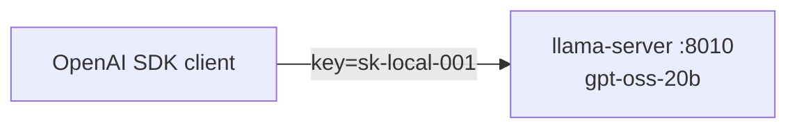
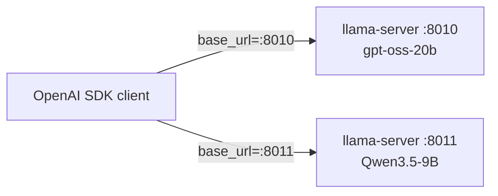
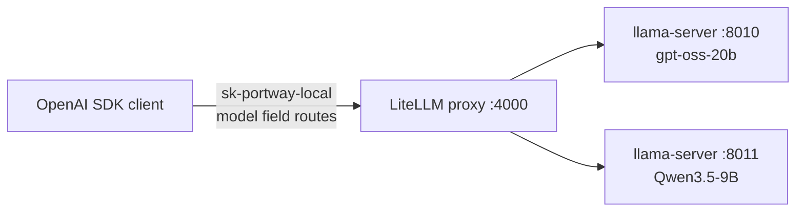
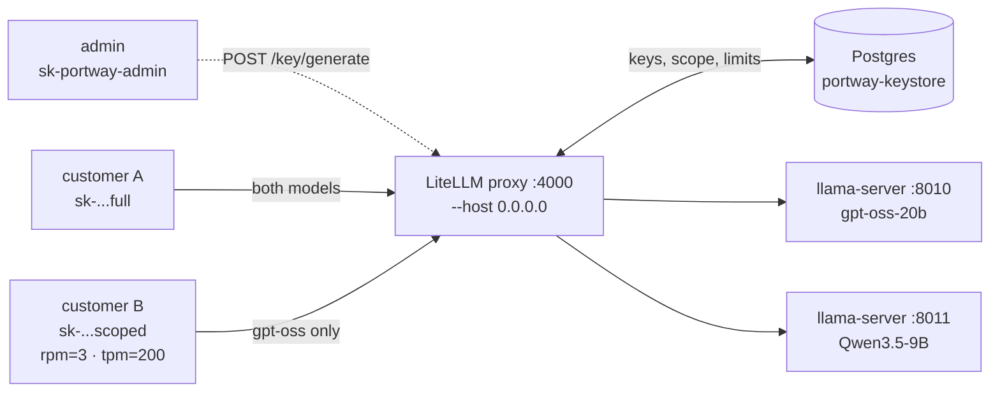

# Build Your Own AI Model Provider — A Build-Along Series

*A hands-on path from "one model on the laptop on your desk" to a production, multi-model, OpenAI-compatible inference service with routing, auth, metering, and billing — that runs the same whether you deploy it on a homelab box, a US cloud, or a Canadian sovereign host.*

**Core principle of this series: location is a late, swappable decision.** You build and prove the entire product **locally, with zero cloud**, on hardware you already own. *Where* it eventually runs — your basement server, AWS us-east, GCP Montréal, a sovereign Canadian host — is a deployment-time choice you bolt on near the end, not an architectural assumption baked into the code. Canada appears later only as **one worked example** of a region/residency policy; the same recipe applies to the US, the EU, or anywhere else.

**Target stack:** open models served by **vLLM** (or **llama.cpp** when you're on a Mac/CPU), fronted by a **LiteLLM** gateway (or a thin FastAPI router), with a metering DB and an optional thread store. We'll use **gpt-oss-20b** and **Qwen3.5** as the two demo models — both open-weight (Apache-2.0 / open) and small enough to run on a single machine.

**How to use this series:** each post is a self-contained practice milestone — goal, what you build, exact steps, and a **Definition of Done** you can demo before moving on. Don't skip the DoD; later posts assume the prior artifact exists. Posts 1–7 need **no cloud account and cost $0** beyond electricity. Cloud only enters at Post 9, and even then it's optional.

**Audience:** comfortable with Linux, containers, HTTP, Python. We won't explain REST; we *will* be precise about what bites (streaming usage, KV-cache sizing, MXFP4 on the wrong arch, location leaks).

---

## The end state (so each post has a destination)

```
                       ┌──────────────────────────────────────────────┐
   agents / apps       │   DEPLOYMENT TARGET  (pluggable, chosen late) │
   (carry their        │   laptop · homelab · any cloud · any region   │
    own history) ──────┼──▶ ┌──────────┐    ┌───────── vLLM/llama.cpp ─┐│
                       │    │ LiteLLM  │───▶│  gpt-oss-20b  (served)   ││
                       │    │ gateway  │    └──────────────────────────┘│
                       │    │ • auth   │    ┌───────── vLLM/llama.cpp ─┐│
                       │    │ • routing│───▶│  qwen3.5  (served)       ││
                       │    │ • meter  │    └──────────────────────────┘│
                       │    └────┬─────┘                                 │
                       │         ▼                                       │
                       │   ┌──────────────┐  ┌──────────────┐            │
                       │   │ metering DB  │  │ thread store │            │
                       │   └──────────────┘  └──────────────┘            │
                       └──────────────────────────────────────────────┘
```

### How the system evolves, post by post

Each post adds one piece. The diagrams below trace that progression — the same shape grown four times.

**Post 1 — one model, one process, one client:**


**Post 2 — second backend on a second port; the client picks the URL:**


**Post 3 — gateway in front; the client picks the model, not the URL:**


**Post 4 — admin/customer key split, Postgres-backed virtual keys, per-key scoping + rate limits, LAN-reachable:**


Posts 5–14 keep this shape and add: metering (Post 5), client-side conversation state (Post 6), performance characterization (Post 7), containerization (Post 8), cloud deploy (Post 9), residency overlays (Post 10), scaling (Post 11), users/teams/admin UI (Post 12), observability + billing + hardening (Post 13), and extending the catalog (Post 14).

Four rules that hold the whole way through:
1. **Backends are stateless.** History is carried by the client every request; the server's KV/prefix cache makes the repeated prefix cheap, but it's a cache, never state.
2. **Everything speaks OpenAI `/v1/chat/completions`.** That uniform wire format makes routing, swapping, and extending a config change instead of a rewrite.
3. **Location is configuration, not architecture.** Nothing in the core hardcodes a provider, region, or even "cloud." The dashed box above is a target you pick at the end and can change later.
4. **Where data flows is a policy you apply to a target, not a property of the code.** Residency/sovereignty (Post 10) is an overlay you switch on for a chosen region — Canada, EU, US, whatever — without touching the build.

---

## Post 1 — Local-first: a model on your own machine, zero cloud

**Goal:** stand up a single model behind an OpenAI-compatible endpoint **on hardware you already own**, and call it from the official OpenAI SDK. No accounts, no spend. Internalize the stateless contract.

**Why first:** everything else is this, multiplied and wrapped. If you can't reason about one local model server, you can't debug ten in the cloud. Starting local also means your dev loop is free and offline.

**Pick your local path by hardware** (all converge on the same OpenAI-compatible endpoint):

| Your machine | Engine | Demo model that fits |
|---|---|---|
| **NVIDIA 24GB consumer GPU** (RTX 3090/4090/5090) | **vLLM** | gpt-oss-20b (~16GB MXFP4) |
| **Apple Silicon** (M-series, ≥24–32GB unified) | **llama.cpp** | gpt-oss-20b or Qwen3.5-9B GGUF |
| **CPU-only / small VRAM** | **llama.cpp** | Qwen3.5-2B/4B (correctness over speed) |

**NVIDIA path (vLLM):**
```bash
pip install vllm
vllm serve openai/gpt-oss-20b \
  --served-model-name gpt-oss \
  --max-model-len 32768 \
  --api-key sk-local-001
# MXFP4 is native on Blackwell (5090); on Ampere (3090) it runs via Triton/Marlin — same command, slower.
```

**Mac / CPU path (llama.cpp):**
```bash
# llama.cpp ships an OpenAI-compatible server
./llama-server -hf <qwen3.5-or-gpt-oss-GGUF-repo> \
  --port 8010 --ctx-size 32768 --alias gpt-oss
# NOTE: use llama.cpp (not Ollama) for Qwen3.5 — its vision GGUFs currently misbehave in Ollama.
```

**Call it** — there is no "session"; you send the whole `messages` array every time:
```python
from openai import OpenAI
client = OpenAI(base_url="http://localhost:8010/v1", api_key="sk-local-001")
r = client.chat.completions.create(
    model="gpt-oss",
    messages=[{"role":"user","content":"Name three Canadian cities."}])
print(r.choices[0].message.content)
print(r.usage)   # prompt/completion/total tokens — your future bill, even locally
```

**Things that will bite:**
- **`--max-model-len` / `--ctx-size` sizes the KV cache.** Leave it at the model's 256K default and VRAM/RAM vanishes. Cap it.
- **gpt-oss emits a reasoning channel** (Harmony format). The engine applies the template automatically; you still get a normal `message.content`. Note it now — we segregate it in Post 3.
- If a full model won't fit, **drop to a smaller Qwen3.5 (4B/2B)** just to exercise the plumbing. The point of [Post 1](./1%20-%20Local-first:%20a%20model%20on%20your%20own%20machine,%20zero%20cloud.md) is the contract, not the model.

**Definition of Done** — Cost: $0
- [ ] OpenAI SDK round-trips against `localhost`
- [ ] Can explain why 5 turns vs 1 turn changes `prompt_tokens` while the server remembers nothing

---

## Post 2 — Two models locally, and the art of placing them

**Goal:** run gpt-oss-20b and Qwen3.5 simultaneously on your one machine; understand the placement strategies that scale up later unchanged.

**Concept — one model per server process.** Two models = two servers on two ports. Where they live is the decision (identical logic whether "where" is your GPU or a future cloud card):

| Strategy | When | Trade |
|---|---|---|
| **Co-located** (two processes, one device) | Both fit in VRAM/RAM | Cheapest; processes share the memory budget — size carefully |
| **One device each** | Need isolation / independent scaling | Cleaner; needs a second device |
| **Base + LoRA adapters** | Your "two models" share a base | Near-free second model (not our case — different bases) |

**Local co-location on a single 24GB card** — gpt-oss-20b (~16GB) leaves little room, so use a **small Qwen** locally (9B at 4-bit ≈ ~7GB, or 4B for comfort). The capability jump to Qwen3.5-35B-A3B (an MoE with only ~3B active params) is something you unlock when you have more VRAM later; locally, prove the *pattern* with a small Qwen.

```bash
# two vLLM processes, two ports, shared GPU — split the memory budget
CUDA_VISIBLE_DEVICES=0 vllm serve openai/gpt-oss-20b \
  --served-model-name gpt-oss --port 8010 \
  --max-model-len 16384 --gpu-memory-utilization 0.55
CUDA_VISIBLE_DEVICES=0 vllm serve Qwen/Qwen3.5-4B \
  --served-model-name qwen3.5 --port 8011 \
  --max-model-len 16384 --gpu-memory-utilization 0.35
```

**Landmines:** `--gpu-memory-utilization` is how you stop co-located processes from fighting. Qwen3.5 is natively multimodal — ignore image inputs if you only need text. Stay on vLLM/llama.cpp, not Ollama, for Qwen3.5.

**Definition of Done** — Cost: $0
- [ ] Both `:8010/v1/models` and `:8011/v1/models` report their served names
- [ ] Both answer chat completions
- [ ] The machine doesn't OOM under a few concurrent requests

---

## Post 3 — The gateway: route by model name

**Goal:** one local endpoint; the client picks the model via the `model` field; you route to the right backend. This is the "be OpenRouter" core — and it's pure software, so it's identical local or cloud.

**Concept.** The OpenAI schema already requires a `model` field. The gateway treats it as the routing key, rewrites it to the backend's served name, and streams the response straight through.

**Option A — LiteLLM Proxy (recommended):**
```yaml
# config.yaml
model_list:
  - model_name: gpt-oss
    litellm_params: { model: hosted_vllm/gpt-oss, api_base: http://127.0.0.1:8010/v1, api_key: sk-local-001 }
  - model_name: qwen3.5
    litellm_params: { model: hosted_vllm/qwen3.5, api_base: http://127.0.0.1:8011/v1, api_key: sk-local-001 }
```
```bash
litellm --config config.yaml --port 4000   # clients now point at :4000
```

**Option B — DIY (~40 lines FastAPI):** a `ROUTES` dict mapping public name → (base_url, backend name, key); look up `body["model"]`, rewrite it, **stream** the upstream response through untouched.

**Don't-forget list:**
- Implement **`GET /v1/models`** returning your *public* names — frameworks call it on startup.
- Unknown model → return the **OpenAI-shaped error object**, not a bare 500.
- **Stream, don't buffer** — buffering breaks token streaming.
- **Strip/segregate gpt-oss's reasoning channel** here before returning to clients; optionally expose a `reasoning_effort` passthrough.

**Definition of Done** — Cost: $0
- [ ] One base URL; flipping `model` between the two names hits different local backends
- [ ] `/v1/models` lists both model names
- [ ] A bad model name returns a clean 404

---

## Post 4 — Auth, API keys, and per-key model scoping

**Goal:** issue keys to callers, decide which models each key may use, rate-limit them. The line between "my toy" and "a service" — still entirely local.

**Concept.** Your *internal* backend keys are not your *customers'* keys. The gateway mints customer keys and maps them to permissions.

- **LiteLLM:** enable the virtual-key system (backed by a local Postgres in Docker); mint keys scoped to `["gpt-oss"]` or both, each with RPM/TPM limits and an optional spend budget.
- **DIY:** a `keys` table (`key_hash`, `allowed_models[]`, `rpm`, `tpm`, `monthly_budget`, `org_id`) + middleware that authenticates, checks model scope, and token-bucket rate-limits (local Redis).

**Bake in now (painful later):** store key **hashes**, never raw keys; **per-key model scoping** is your tiering primitive; rate-limit on **tokens/min**, not just requests/min.

**Definition of Done** — Cost: $0
- [ ] Two customer keys issued, one scoped to `gpt-oss` only
- [ ] The scoped key gets a clean 403 on `qwen3.5`
- [ ] Exceeding RPM returns 429

---

## Post 5 — Token tracking & metering (the part everyone gets subtly wrong)

**Goal:** capture exact input/output tokens per request, attribute to key/model, compute cost, store it. Your billing source of truth — built and tested locally.

**Concept.** Every OpenAI-compatible response carries `usage`. Capture it **at the gateway** — the one choke point seeing key + model + usage together. Never trust client counts; never estimate `len(text)/4`.

**The streaming gotcha (the famous trap):** with `stream: true` there is **no `usage` by default**. You must request it and read the **final** chunk:
```python
body["stream_options"] = {"include_usage": True}
```
Miss this and your streamed traffic — most of it — bills as zero.

**Metering row, one per request:** `request_id, ts, api_key_id, org_id, public_model, backend_model, prompt_tokens, completion_tokens, total_tokens, ttft_ms, total_latency_ms, status, computed_cost`.

**Per-model price table** — the two models tokenize and cost differently, so pricing and counting are per-model. Compute `computed_cost` at write time so later price changes don't rewrite history.

**Two stores, two access patterns — don't conflate:** metering = append-only, high-volume (analytics table); thread store (Post 6) = transactional read-modify-write (Postgres/Redis). Locally both can be Docker containers or even SQLite to start.

**Request IDs first-class:** generate at the gateway, propagate to backend and every log line, return to the client.

**Definition of Done** — Cost: $0
- [ ] A streamed request produces a metering row with correct non-zero tokens and a computed cost
- [ ] A non-streamed request produces a metering row with correct non-zero tokens and a computed cost
- [ ] Can `SELECT` spend grouped by key and model

---

## Post 6 — Conversation state & context management

**Goal:** build a thin agent/app that carries history correctly and handles window overflow. Confirm the server stays stateless.

**Concept.** History lives client-side (or in an app-owned thread store), not in the inference layer. Each turn: load thread → assemble `messages[]` → send the whole thing → append the new turn.

**Thread store:** `threads(thread_id, org_id, created_at)` + `messages(thread_id, idx, role, content, tokens, created_at)`.

**Context assembly (where quality dies quietly), increasing sophistication:** truncate (keep system + recent N) → summarize/compact older turns → externalize to RAG. Always **budget tokens** — reserve room for the completion.

**"Isn't resending everything wasteful?"** On the wire, yes; in compute, no — vLLM's **automatic prefix caching** skips recomputing the unchanged prefix. Qwen3.5's hybrid attention also keeps the KV footprint smaller at long context. Compute is what you pay for, so it's cheap where it counts.

**Definition of Done** — Cost: $0
- [ ] A 10-turn chat demonstrates no server session (stateless)
- [ ] Prefix caching makes late turns cheaper than cold turns
- [ ] An overflow strategy keeps a 50-turn thread under `max-model-len`

---

## Post 7 — Streaming, performance & load (still local)

**Goal:** measure throughput and latency on your own hardware; stop optimizing single-request speed.

**Metrics that matter:** TTFT (p50/p95) and tokens/sec under concurrent load; plus queue depth and error rate per backend.

**Levers, by impact:** continuous batching (vLLM default — verify it engages) → quantization (MXFP4 native on right arch) → prefix/KV caching → speculative decoding → chunked prefill.

**Load test locally:**
```bash
vllm bench serve --model gpt-oss --base-url http://localhost:8010 \
  --request-rate 4 --num-prompts 200
```
Sweep concurrency until p95 TTFT degrades — that knee is your per-replica capacity *on this hardware*. You'll learn your local ceiling, which tells you exactly what you'd need to rent later (Post 9).

**Definition of Done** — Cost: $0
- [ ] Documented capacity number (TTFT p50/p95, tokens/sec) per model on your machine
- [ ] Continuous batching confirmed active
- [ ] Prefix cache confirmed active

> **Milestone:** at the end of Post 7 you have a *complete, working AI provider running entirely on your own hardware* — multi-model, routed, authed, metered, load-characterized. Everything after this is about running it somewhere else and making it robust. None of it requires rewriting the core.

---

## Post 8 — Containerize & make deployment location-agnostic

**Goal:** package the whole system so it runs **identically** on your laptop, a homelab server, or any cloud — by pushing every environment/location specific into config. This is the post that makes "pick any location later" true.

**Concept — 12-factor the stack.** Nothing in an image knows where it runs. Externalize: model names & served-names, device/quantization flags, DB URLs, keys/secrets, bind addresses, and **the deployment target itself**.

**Compose (runs on any Docker host — your homelab tonight, a cloud VM tomorrow):**
```yaml
services:
  gpt-oss:  { image: vllm/vllm-openai, command: ["--model","openai/gpt-oss-20b","--served-model-name","gpt-oss", ...], gpus: all }
  qwen35:   { image: vllm/vllm-openai, command: ["--model","${QWEN_MODEL}","--served-model-name","qwen3.5", ...], gpus: all }
  gateway:  { image: litellm/litellm, env_file: .env, depends_on: [gpt-oss, qwen35] }
  meter-db: { image: postgres, volumes: ["./data:/var/lib/postgresql/data"] }
```

**The "deployment target" abstraction.** Keep a small set of overlay configs — `target.local.env`, `target.homelab.env`, `target.cloud-us.env`, `target.cloud-ca.env` — that differ only in: GPU type/flags, model sizes (small locally, larger on bigger cards), DB endpoints, bind/TLS, and a `REGION`/`DATA_POLICY` label. Switching targets is `--env-file target.X.env`, not a code change. **This is the mechanism that lets you choose location now and change it later.**

**Homelab note:** a box on your LAN with a 24GB card is the natural bridge between "laptop" and "cloud" — same compose file, left running, reachable on your network. Great for an always-on internal endpoint with zero cloud spend.

**Definition of Done** — Cost: $0 (your hardware)
- [ ] The same images come up on two different targets (e.g. laptop and homelab) with only the env-file differing
- [ ] The gateway serves both models on each target

---

## Post 9 — Deploy to a cloud — any provider, any region

**Goal:** lift the containerized stack onto rented hardware, treating provider and region as **pluggable choices**, not assumptions.

**Concept.** Because Post 8 made the stack location-agnostic, "go to cloud" is: pick a provider+region, provision a GPU host, point a `target.cloud-*.env` at it, `docker compose up`. The core is untouched.

**Choosing hardware (generic, any region):** size the card to your *largest co-located* model. gpt-oss-20b + Qwen3.5-9B fits a ~48GB card; gpt-oss-20b + Qwen3.5-35B-A3B wants an 80GB card (H100/A100); gpt-oss-120b needs ≥80GB on its own. Rent **on-demand** first; commit/spot later once load is steady.

**Picking a region is now a menu, not a constraint:**
- **US / EU / APAC hyperscaler or neo-cloud** — widest current-gen GPU supply, lowest prices, best spot availability.
- **Specific-country region** — choose it when latency-to-users or a data policy calls for it. *(Heads-up: current-gen GPU availability varies wildly by country region — verify launchable capacity, not just catalog listings, before committing.)*

**Rough on-demand cost (per always-on GPU, ~730 hr/mo), region-generic:**
| Co-located pair | Card | ~$/mo (US/EU neo-cloud) | ~$/mo (premium/scarce region) |
|---|---|---|---|
| gpt-oss-20b + Qwen3.5-9B | 1× L40S 48GB | ~$650–1,150 | higher |
| gpt-oss-20b + Qwen3.5-35B-A3B | 1× H100 80GB | ~$1,800 | ~$2,200 |
| gpt-oss-120b + Qwen3.5-35B-A3B | 1× H100 + 1× L40S | ~$2,500–3,300 | higher |

**Definition of Done**
- [ ] The same stack from Post 8 serves publicly from a rented GPU in a region you chose
- [ ] Switching the target env-file to a different region/provider redeploys without code changes

---

## Post 10 — (Optional overlay) Data residency & region policy — Canada as a worked example

**Goal:** when a use case demands that data stay in a chosen jurisdiction, apply a **residency/sovereignty policy** as an overlay on any target — without changing the build. Canada is the example here; the identical recipe maps to EU/GDPR, US, or any country.

**First, the fork that picks your provider for a given region:**
- **Residency** = data physically in the chosen country. Satisfied by that country's region on most clouds.
- **Sovereignty** = no foreign legal framework can reach it. Note the catch: under the US CLOUD Act, US-headquartered providers can be compelled regardless of where the rack sits — so true sovereignty needs a **locally-headquartered** provider.

**The policy is a boundary you draw around every data-touching hop** — and it's the same shape in any jurisdiction:
- Gateway **and** backends co-located in the chosen region; no cross-border hop between them.
- **Metering DB + dashboards + logs in-region** (shipping usage logs to an out-of-region observability tenant silently breaks it).
- **Edge/TLS termination + CDN in-region.**
- **External fallback now conflicts with the policy** — routing overflow to an out-of-region provider exports the prompt. Constrain fallbacks to in-region backends only. (Keep the routing table; just make every route resolve in-region.)

**Worked example — Canada:** for **residency**, a Canadian region of a major cloud or a Canadian datacentre (e.g. a Toronto GPU host) works. For **sovereignty**, choose a Canadian-HQ provider (sovereign GPU clouds exist in AB/QC). This matters in practice — a 2026 federal+provincial privacy finding against a major US AI service is exactly why regulated Canadian buyers now insist on it. **Swap "Canada" for "Germany" or "the EU" and the steps are unchanged** — that's the point of keeping it an overlay.

**Definition of Done**
- [ ] With one target env-file, a request's full path (edge → gateway → backend → metering → logs) provably stays in the chosen region
- [ ] Fallbacks resolve in-region only
- [ ] Flipping to a different jurisdiction's env-file moves the whole boundary with no code change

---

## Post 11 — Scaling & reliability

**Goal:** survive bursts, deploys, and failures — appropriate to your actual load — on whatever target you're running.

**Two regimes:** **scale-to-zero serverless** (best for spiky traffic; keep `min_workers=1` on the latency-critical model to dodge cold starts; verify the provider offers your required region) vs. **dedicated horizontal** (replicas behind the gateway, scale on queue depth/GPU util; LiteLLM round-robins duplicate `model_name` entries; `fallbacks` spill to another **in-policy** replica).

**Reliability musts:** health checks with unhealthy-backend ejection; zero-downtime deploys (start new replica → health-check → drain old; weights take time to load); explicit graceful-degradation policy (fail clean vs. substitute a model with a header noting it).

**Definition of Done**
- [ ] Kill a backend mid-load and watch traffic survive via ejection + fallback
- [ ] A deploy completes with zero failed requests

---

## Post 12 — Users, teams, admin UI, and registration

**Goal:** put humans in front of the system. Add team/org grouping, separate UI-admin credentials from the API master_key, expose a real signup flow, and wire role-based access so customers, internal admins, and billing-only viewers each see the right slice.

**Why a dedicated post:** Post 4 gave us virtual keys but they're mint-by-curl-only. Post 5's metering produces per-key rows but no one can read them without API access. LiteLLM's bundled admin UI (auto-mounted at `/ui/` whenever `database_url` is set — see Post 4's "Bonus" section) is the first usable surface, but out of the box the master_key doubles as the UI password and there are no teams, no self-serve signup, no role split. This post turns it into a product face.

**Concept — three roles, three surfaces:**
- **Customer.** Hits `/v1/chat/completions` with a virtual key. Should never see the admin UI.
- **Org admin.** Manages keys/budgets/spend for their own team via a scoped UI login. Doesn't touch other orgs.
- **Proxy admin (you).** Mints orgs, reads everything, rotates the master_key.

**Build sequence:**
- **Decouple UI auth from master_key.** Add `ui_username` / `ui_password` under `general_settings` (Post 4 "things that bit" #14 calls this out as a moment-you-go-past-localhost fix). Now the master_key stays for API mint, the UI uses its own creds.
- **Teams + organizations.** LiteLLM's `/team/new` and `/organization/new` endpoints. Each customer becomes a team; org admins get keys scoped to their team's `team_id`. Budgets aggregate at the team level so a single customer with 5 keys shares one monthly cap.
- **Self-serve signup.** Stand up a tiny FastAPI/Next.js page that takes email → creates user → mints a starter virtual key (limited models, low rpm/tpm, $1 trial budget) → emails the `sk-...` once and never again. The actual "key shown once" behavior from Post 4 #6 is the security backbone here.
- **Role-based dashboards.** Reuse LiteLLM's per-key spend views but filter by role: customer sees own usage, org admin sees their team, proxy admin sees everything.
- **SSO (optional).** LiteLLM supports SAML/OIDC for the admin UI; wire it for the org-admin role so customers don't manage another password.

**Bake in now (painful later):** every UI access produces an audit row (who/when/what); make the signup endpoint rate-limited and CAPTCHA'd before you publicize the URL; never log raw keys, hashes only.

**Definition of Done** — Cost: $0 (still local; same Postgres backs it)
- [ ] UI login works with `ui_username`/`ui_password`; the master_key still works for API admin but does NOT log into the UI.
- [ ] A stranger hits `/signup`, gets a starter virtual key in their email, can call `gpt-oss` with it.
- [ ] An org admin sees only their team's keys and spend, not other orgs'.
- [ ] An audit row is written for every UI mint/revoke.

---

## Post 13 — Observability, billing, hardening & launch

**Goal:** turn the working system into a product that can actually run in production. Post 12 put humans in front of it; Post 13 makes it survivable under load and durable against operator mistakes.

**Observability:** dashboards over the metering store — RPS, TTFT p50/p95, tokens/sec, error rate, spend, sliceable by key, team, and model; alert on p95 TTFT, error rate, budget breaches. (Keep these in-policy if a residency overlay is active.)

**Logging policy — deliberate:** always log metadata (tokens, latency, model, key, request_id, team_id); make prompt/completion content logging opt-in, redacted, short-retention. Retrofitting redaction is miserable.

**Billing:** roll metering up per org per month against the price table; choose prepaid credits vs. postpaid; wire budget enforcement back to the Post-4 key limits and Post-12 team budgets (maxed budget → 402/429, not a surprise invoice).

**Hardening:** rotate keys; secrets in a manager; TLS everywhere; network-isolate backends so only the gateway reaches them; edge abuse protection; rate-limit the Post-12 signup endpoint.

**Launch:** docs ("point your OpenAI SDK at `https://<you>/v1`, here are the model names"). That last line is the payoff — customers integrate by changing a base URL.

**Definition of Done**
- [ ] Customer-facing dashboards render real spend within seconds of a request landing.
- [ ] An operator can rotate the master_key without dropping in-flight requests.
- [ ] An exceeded team budget returns `402` cleanly; the next month auto-resets.
- [ ] All prompts/completions are off by default; turning content logging on requires a config change AND retention policy.

---

## Optional Post 14 — Extending the catalog (the real OpenRouter move)

Adding models is routine once the machine works: new `vllm serve` + one routing-table entry (mind VRAM placement); LoRA fine-tunes multiplex on one process if they share a base; and the same router can front *any* OpenAI-compatible upstream — within a residency overlay that means more in-region backends, and without one it means external providers as routes, which is exactly OpenRouter's model.

---

## Series map at a glance

| Post | Milestone | Cloud? | Cost |
|---|---|---|---|
| 1 | One model, local, OpenAI-compatible | No | $0 |
| 2 | Two models + placement | No | $0 |
| 3 | Gateway / model-name routing | No | $0 |
| 4 | Auth, keys, scoping | No | $0 |
| 5 | Token metering (+ streaming trap) | No | $0 |
| 6 | State & context management | No | $0 |
| 7 | Performance & load | No | $0 |
| **—** | **Working provider, 100% local** | **No** | **$0** |
| 8 | Containerize, location-agnostic | No | $0 |
| 9 | Deploy to cloud — any provider/region | Optional | rental |
| 10 | Residency/sovereignty overlay (Canada example) | Optional | rental |
| 11 | Scaling & reliability | Optional | rental |
| 12 | Users, teams, admin UI, registration | Optional | rental |
| 13 | Observability, billing, hardening, launch | Optional | rental |
| 14 | Extending the catalog | Optional | — |

## Recurring Definition-of-Done checklist
- [ ] Stateless backends — server holds no conversation
- [ ] Every hop OpenAI-compatible — model swap is config, not code
- [ ] Location externalized — no provider/region hardcoded in the core
- [ ] Streaming usage captured (`include_usage`) — no zero-billed streams
- [ ] Per-model price table & per-request metering row with request_id
- [ ] Per-key model scoping + token-based rate limits
- [ ] (If residency overlay active) gateway, backends, metering, logs, edge all in chosen region; fallbacks in-region only
- [ ] Content logging opt-in/redacted; metadata always
